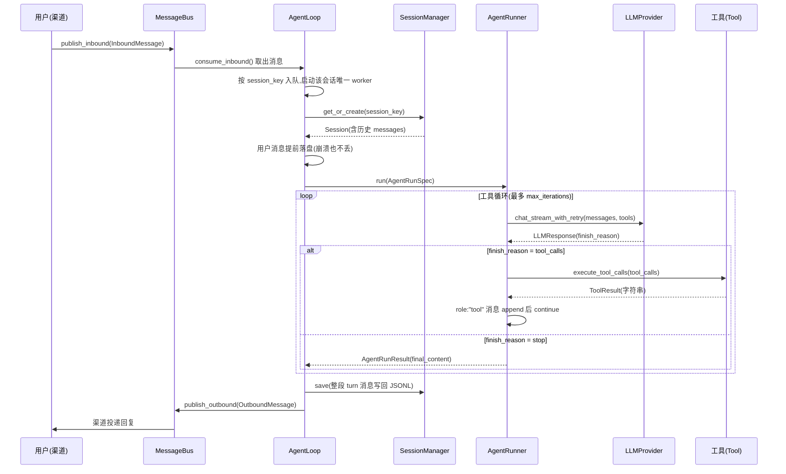

# 核心业务流程

> nanobot 主链路详解。所有路径相对 `nanobot/nanobot/nanobot/`。

## 1. 主 Happy Path（一条用户消息的一生）



### 关键代码坐标

| 环节 | 位置 |
|---|---|
| AgentLoop 主循环 | `agent/loop.py:1310` `AgentLoop.run()` await `bus.consume_inbound()` |
| 每会话队列/worker | `agent/loop.py:1417` `_enqueue_session_message`、`:1442` `_run_session_queue` |
| turn 六阶段 | `agent/loop.py:1780-1791` `_process_message`：restore(`:1899`) → compact(`:1956`) → command(`:1964`) → build(`:2016`) → run(`:2125`) → save(`:2165`) → respond(`:2214`) |
| 工具循环本体 | `agent/runner.py:368-850` `AgentRunner._run_core`（for iteration: 请求模型 → 有 tool_calls 则执行回填 → 无则收尾 break） |
| 模型请求 | `agent/runner.py:871` `_request_model` → `:994` `provider.chat_stream_with_retry` |
| 工具执行 | `agent/tools/execution.py:57` `execute_tool_calls`（concurrency_safe 的工具 gather 并行） |
| 结果回填 | `agent/runner.py:538-549` 组 `role:"tool"` 消息 append 进 transcript |
| 会话保存 | `agent/loop.py:2165` `_persist_turn` → `session/manager.py` `JsonlSessionStore` 原子重写 |
| 回复投递 | `agent/turn_delivery.py:194` `TurnDelivery.complete` → bus.outbound |

## 2. 流式输出旁路（与主链并行）

正文不是等 LLM 全部生成完才给用户，而是边生成边推：

```text
provider.chat_stream 的每个 chunk
  → 回调 on_content_delta(text)
  → AgentHook.on_stream（钩子层，错误隔离的扇出）
  → AgentProgressHook.on_stream（适配器, progress_hook.py:70）
  → EventSink.publish(StreamDeltaEvent)
  → TurnDelivery 路由到 bus → 渠道/WebUI 逐字显示
```

- 工具调用间隙 `on_stream_end(resuming=True)` 保持前端"卡片"不关闭，回复分多段流式。
- 最终 outbound 带 `StreamedResponseEvent` 标记，避免流式之后再重复发全文（`loop.py:1764-1778`）。

## 3. 上下文组装（build 阶段）

`ContextBuilder`（`agent/context.py:89`）产出发给 LLM 的最终消息序列：

```text
[system]  = 身份模板 + AGENTS.md/SOUL.md/USER.md + 工具契约 + 长期记忆(MEMORY.md)
           + always-on 技能全文 + 其余技能摘要 + 会话归档摘要
[user/assistant/tool ...]  = 历史（经水位切片/清洗）
[user]    = 当前消息 + runtime context 块（$skill 显式调用等）
```

请求前 `ContextGovernor.prepare_request`（`context_governance.py:617`）做清洗（剥占位/畸形消息、孤儿 tool 结果修复、工具结果字符截断）与 token 预算检查，超预算时把旧历史替换为 LLM 生成的摘要 checkpoint。

## 4. 数据流总览（哪里产生、哪里保存、谁读取）

```text
用户消息      渠道产生 → bus → AgentLoop → Session.messages(JSONL 落盘) → ContextBuilder 读取
助手消息      AgentRunner 从 LLMResponse 构造 → Session(JSONL) → 下轮作为历史
工具调用/结果 runner append 到 transcript → Session(JSONL) → 下轮历史
长期记忆      Consolidator 摘要/Dream 巩固 → MEMORY.md/SOUL.md/USER.md + history.jsonl → ContextBuilder 注入
用量统计      每次 provider 调用 → llm_usage.sqlite3(llm_calls 表) → WebUI 图表
事件          runner/重试/压缩逻辑 → EventSink → bus → 渠道/WebUI 订阅者
```

## 5. 异步/并发要点

- 全异步（asyncio）：一次网关进程内，多会话 worker、多渠道收发、cron、Dream 同时推进。
- **每会话串行**：一个 session 一个 FIFO 队列 + 唯一 worker，保证同会话 turn 顺序；跨会话天然并发；全局 `NANOBOT_MAX_CONCURRENT_REQUESTS` 信号量限流。
- 工具级并发：`concurrency_safe` 的工具在同一批 tool_calls 里 `asyncio.gather` 并行；`exclusive` 工具独占执行。
- 子代理：后台 `asyncio.Task` + 信号量限并发；完成后以系统 InboundMessage 回注主会话。

## 6. 教学重建时的主线映射

教学项目按同一条主线生长，但结构允许不同：

| 原项目环节 | 教学演化（对应课） |
|---|---|
| provider.chat 一次调用 | 第 1 课（单问单答脚本） |
| Session 历史 | 第 2 课（内存）→ 第 5 课（JSONL 持久化） |
| 工具循环 | 第 3 课（手写 while） |
| Tool/Registry 抽象 | 第 4 课（第二个工具出现后重构） |
| ContextBuilder/截断 | 第 6 课 |
| 流式旁路 | 第 7 课 |
| 重试 | 第 8 课 |
| 渠道/CLI | 第 9 课（终端）、第 15 课（HTTP API） |
| 文件/shell 工具 | 第 10-11 课 |
| SubagentManager | 第 12 课 |
| MemoryStore | 第 13 课 |
| Config/pydantic | 第 14 课 |
| LLMProvider 抽象/fallback | 第 16 课 |
| MessageBus | 第 15 课前后按渠道需求引入 |
