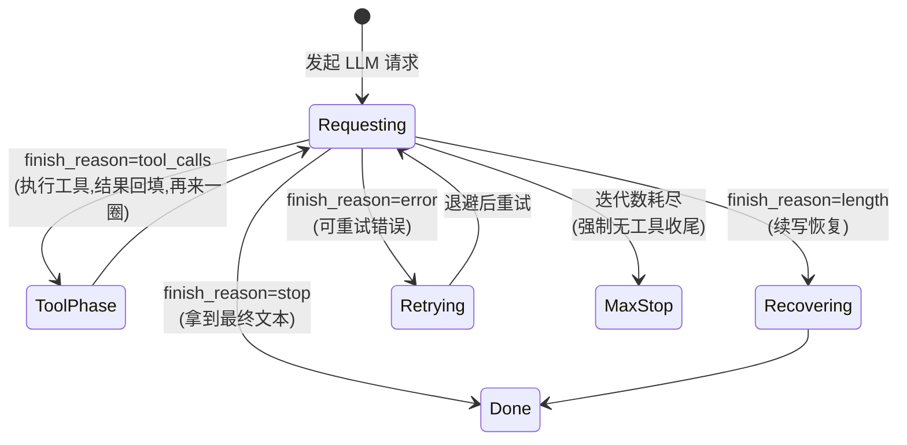
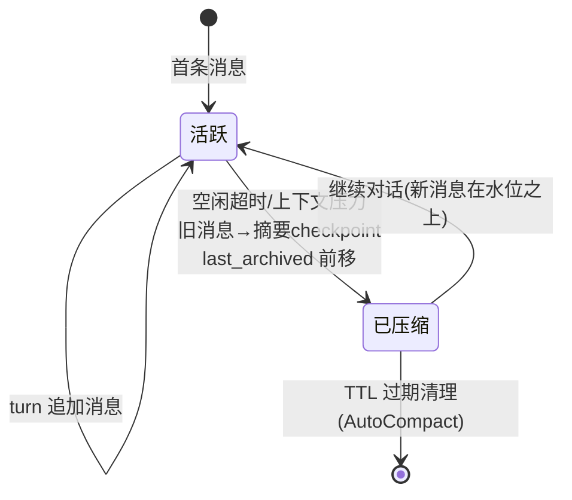

# 状态模型

> nanobot 里值得单独拎出来的生命周期与状态机。路径相对 `nanobot/nanobot/nanobot/`。

## 1. LLM 响应的 finish_reason（工具循环的 steering 信号）

工具循环每一圈的"方向盘"。`AgentRunner._run_core`（`agent/runner.py:368`）据此决定继续还是收尾：



- **谁产生**：provider 解析各厂商原生信号后统一写入（Anthropic `tool_use→tool_calls`、`end_turn→stop`、`max_tokens→length`）。
- **谁消费**：`AgentRunner`（决定循环方向）、`should_execute_tools` 属性（是否执行工具）。
- **存哪**：只在 turn 内存中流转；错误元数据（error_kind 等）随 LLMResponse 带给上层。

## 2. Turn（一问一答回合）的生命周期

`_process_message`（`agent/loop.py:1780`）的六阶段即 turn 状态：

```text
restore(取会话/恢复) → compact(空闲摘要) → command(/命令短路) → build(组装)
→ run(LLM+工具循环) → save(落盘) → respond(投递回复)
```

- 用户消息在 build 之前**提前落盘**（`_persist_user_message_early`，崩溃也不丢）；运行中反复写 `.checkpoint.json` sidecar 保存易变状态，加载时 overlay。
- turn 结束发 `TurnCompleted`/`SessionTurnPersisted` 运行时事件（WebUI/SDK 消费）。

## 3. 会话（Session）的压缩水位



- `last_archived` 是**整数水位线**（已归档的最后一条消息下标），不是布尔标志——同会话可多次分批压缩。
- 摘要 checkpoint 以隐藏 user 消息形式插在边界；`get_history` 只回放水位之后的原始消息 + 摘要。
- 谁改水位：`Consolidator.summarize_transcript`（`agent/memory.py:1087`）；谁读：回放、ContextGovernor。

## 4. 重试状态（provider 层）

`RetryStatusEvent.state`：`waiting → recovered / cleared / exhausted`。

- 基类 `_run_with_retry`（`providers/base.py:1792`）：指数退避 1/2/4s；`retry_mode=persistent` 无限重试（同一错误 10 次后停）；尊重 `Retry-After`。
- **已流出内容的流式错误不重试**（避免重复输出），除非 timeout 走"流恢复"分段续传。
- FallbackProvider 之上还有**主 provider 熔断**：连续 3 次失败 → 60s 冷却 → 半开探测。

## 5. 子代理状态

`spawn(wait=false)` → 后台 Task 运行中（信号量限并发）→ 完成后以 `sender_id="subagent"` 的系统 InboundMessage 回注主会话；主循环最多等 300s（`loop.py:1117`）。

## 6. 进程/服务状态（gateway）

网关状态写 `~/.nanobot/run/gateway.json`；客户端租约按需拉起、最后一个客户端退出自动关闭（on_demand）或常驻（persistent）；健康探测 `/health`。

## 7. 教学取舍

| 状态机 | 教学处理 |
|---|---|
| finish_reason 驱动的工具循环 | **核心**，第 3 课起逐步引入（先 stop/tool_calls 两态，length/error 后补） |
| turn 六阶段 | 简化为"取会话→组装→循环→保存→回复"直线流程，中后期再谈 |
| 会话压缩水位 | 只讲概念 + 最简单的"保留最近 N 条"截断（第 6 课）；摘要压缩作为扩展讨论 |
| 重试/熔断 | 第 8 课实现"可重试错误 + 指数退避"两态；熔断只讲不实现 |
| 子代理/网关状态 | 第 12 课子代理；网关进程状态省略 |
