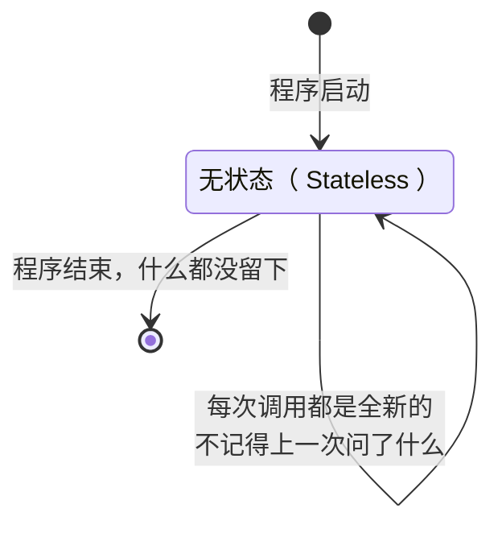
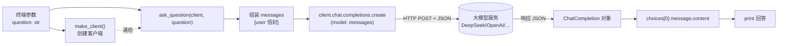
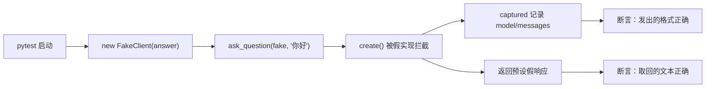

# 第 01 课：第一次对话——写一个会问 AI 的脚本

## 1. 前言

欢迎来到第 1 课。在开始之前，先说清楚我们到底要往哪里走：

整个课程的目标，是亲手造出一个**属于你自己的 AI 助手**——它能陪你在终端里聊天、能读你的代码、能替你跑命令、能记住你的偏好，最后还能变成一个 HTTP 服务被其他程序调用。听起来是个不小的工程对吧？

但任何大工程都是从第一个最小的心愿开始的。今天的心愿非常朴素：

> 我在终端里问它一个问题，它回答我。就这么多。

不需要记忆、不需要工具、不需要界面。就是把你打的一句话送到大模型面前，把它吐回来的答案打印在屏幕上。

这一课我们只解决三件事：

1. **把项目从一片空地盖起来**：目录、git、Python 环境、测试环境（这些是往后十几节课的地基）；
2. **打通"消息进、回答出"**：亲手写出这门课程里被调用次数最多的那个函数；
3. **学会不花钱地测试**：用"假客户端"代替真实 API 来验证我们的代码——这个技巧会陪伴整个课程。

顺便说一句，你将会写出这个项目里的第一行代码。十六节课之后回头看，一切复杂都从这一行开始。

## 2. 主要内容

### 2.1 这节课做什么（文字版步骤）

1. 搭建项目环境：安装 uv 工具、初始化 git 仓库、写 `pyproject.toml`（项目的"身份证"）、安装 openai SDK 和 pytest；
2. 创建 Python 包 `nanobot_st`，在里面写第一个模块 `chat.py`，包含三个函数：
   - `resolve_model()`：从环境变量读模型名（没设置就报一个带操作指引的错）；
   - `make_client()`：创建 OpenAI 客户端（读环境变量里的密钥和服务地址）；
   - `ask_question(client, question)`：本课主角——组装消息、发出请求、取出回答；
3. 写测试 `tests/test_chat.py`：手写一个 `FakeClient` 冒充真客户端，验证 `ask_question` 发出的消息格式正确、取回答案正确；
4. 用真实的 API Key 跑一次命令行问答，亲眼看到它回答。

### 2.2 代码阅读链条（按这个顺序读）

本课有两条独立的链条，都用到了 `ask_question`，这正是它值得设计好的原因。

**链条一：真实运行（花真钱的那条）**

```text
终端执行 uv run python -m nanobot_st.chat 用一句话介绍你自己
→ nanobot_st/chat.py 的 main() 把命令行参数拼成 question 字符串
→ make_client() 创建真实的 OpenAI 客户端（密钥、服务地址都来自环境变量）
→ ask_question(client, question)
     内部先把 question 装进标准信封：[{"role": "user", "content": question}]
     再调 client.chat.completions.create(model=..., messages=...)，得到响应对象
     最后从响应对象里三层取值：response.choices[0].message.content
→ print 打印回答
```

**链条二：测试运行（不花钱的那条）**

```text
运行 pytest
→ tests/test_chat.py 先 new 出 FakeClient（它长得和真客户端一样：都有 .chat.completions.create）
→ ask_question(fake_client, "你好")——函数内部完全不知道自己拿的是假的
→ FakeClient 的 create() 做两件事：把收到的 model/messages 记到 captured；返回一个预设的假响应对象
→ 测试断言：captured 里的消息格式对不对；返回值取的文本对不对
```

### 2.3 流程总结（和"上一课"比多了什么）

这是第 1 课，没有上一课，所以给个总量描述：本课建立的是**主链条的第一节**——从"一个问题字符串"到"一个回答字符串"的直通管道，中间经过一次网络往返。注意它是**直线、单环节、无循环、无状态**的。后面每一课，要么给这条链加新环节（如组装上下文）、要么在中间长出循环（工具调用）、要么给它前后接新的链条（终端界面、HTTP 服务）。记住这条链，以后所有演化都是在它身上动手术。

### 2.4 拔高一下

当前的设计属于**最最基础的功能**：一个纯函数味道的问答（同样的输入问题 → 调 API → 拿回答，中间不记得任何事）。但里面藏着一个不起眼却重要的工程决定——`ask_question` 不自己创建客户端，而是**让别人把客户端递进来**（参数 `client`）。用生活话说：它不关心电话是电信的还是联通的，你递给它什么电话它就用什么电话打。这个小决定今天只是为了"测试时不花钱"，日后会成长为整个项目最重要的架构手法之一（现在不用记，后面自然会体会到）。

## 3. 技术要点

### 3.0 环境配置是基础（本课从零开始，手把手）

本机环境现状（已探测过）：系统 Python 是 3.8（太老，openai SDK 要求 3.11+），未安装 uv，VS Code 装在 Windows 侧、通过 Remote-WSL 连进 Linux。所以我们的路线是：**用 uv 管理 Python 版本和依赖**，它会在项目里自带一个新版 Python，完全不用动系统自带的 3.8。

#### 3.0.1 安装 uv（一次性）

```bash
curl -LsSf https://astral.sh/uv/install.sh | sh
```

装完后重开一个终端，`uv --version` 能出版本号即可。

> uv 是什么：一个一体化的 Python 项目管理器，管 Python 版本（自动下载 3.12）、管依赖（替代 pip+venv）、管运行（`uv run` 自动用对环境）。对我们最大的好处：**绕开系统 Python 3.8 太老的问题**。

#### 3.0.2 VS Code 侧（Remote-WSL）

- 项目在 Linux 文件系统（`~/ln_rebuild_zcode/nanobot/nanobot-st`），用 Windows VS Code 的 "WSL" 远程模式打开这个文件夹（如果没装 WSL 扩展，扩展市场搜 WSL 安装）；
- 在扩展市场安装 **Python** 扩展（ms-python.python，会连带 Pylance）；注意要装在 **WSL: Ubuntu** 侧（扩展页标题栏会显示"在 WSL 中安装"）。

#### 3.0.3 初始化项目（在终端里逐条执行）

```bash
cd ~/ln_rebuild_zcode/nanobot/nanobot-st
git init                                  # 让项目从此有历史
uv python pin 3.12                        # 固定 Python 版本（写入 .python-version）
```

然后手动创建 `pyproject.toml`（项目身份证：我是谁、要什么依赖）：

```toml
[project]
name = "nanobot-st"
version = "0.1.0"
description = "我的个人 AI 助助（教学渐进重建项目）"
requires-python = ">=3.11"
dependencies = [
    "openai>=1.0.0",
]

[dependency-groups]
dev = [
    "pytest>=8.0.0",
]

[build-system]
requires = ["hatchling"]
build-backend = "hatchling.build"

[tool.pytest.ini_options]
testpaths = ["tests"]
```

`[build-system]` 两行的意思：本项目本身也是一个可安装的 Python 包（构建工具用 hatchling——与原项目 nanobot 相同）。有了它，`uv sync` 会把 `nanobot_st` 以"可编辑模式"装进 `.venv`，测试里 `import nanobot_st` 才能成功。

> **国内网络备注（本机实际执行记录）**：
> - GitHub 直连慢，uv 自动下载 Python 会卡死。实际做法：从南京大学镜像站下载
>   `cpython-3.12.14+20260901-x86_64-unknown-linux-gnu-install_only.tar.gz`，
>   解压到 `~/.local/share/uv/python/` 下，再用其中的解释器执行 `uv venv --python <解释器路径>` 创建 `.venv`；
> - PyPI 走清华镜像：`~/.config/uv/uv.toml` 配置了 `https://pypi.tuna.tsinghua.edu.cn/simple`（删除该文件可恢复官方源）。

最后一举创建虚拟环境并安装全部依赖：

```bash
uv sync
```

完成后项目里多出 `.venv/`（专属 Python 环境）和 `uv.lock`（依赖版本锁，**要提交进 git**）。

#### 3.0.4 VS Code 认识这个环境 + 测试按钮在哪

- `Ctrl+Shift+P` → 输入 `Python: Select Interpreter` → 选带 `.venv` 的那项（`Python 3.12 ... ./nanobot-st/.venv/bin/python`）；
- 左侧活动栏点 **Testing 图标（烧杯形状）** → 提示配置 Python 测试 → 选 **pytest**、测试目录选 `tests` → 面板里会出现每一行测试函数，**函数名旁边的绿色 ▶ 就是运行按钮**，点它跑单个测试；
- 也可以随时在终端用 `uv run pytest -v` 跑全部（`-v` 显示每条测试名和通过状态）。

### 3.1 坐标是指南针

当前整个系统长这样（加粗是本课新出现的）：

```text
（目前整个项目只有两个文件）
**nanobot_st/chat.py**     ← 你现在在这里：最底层、最核心的"引擎雏形"
**tests/test_chat.py**     ← 它的旁边：质量哨兵
```

往后十几课里，`chat.py` 会逐渐从一个文件长成一个引擎包，再被终端界面、HTTP 服务共享。今天的它处在系统的**最中心位置**——所有未来的调用链都要经过今天写的 `ask_question` 的后代。

### 3.2 代码是中心

#### 文件一：`nanobot_st/chat.py`

```python
"""第一次对话：把一个问题发给大模型，拿回回答。"""

import os
import sys

from openai import OpenAI


def resolve_model() -> str:
    """从环境变量读取要用的模型名；没设置时报错并给出操作指引。"""
    model = os.environ.get("NANOBOT_ST_MODEL")
    if not model:
        raise RuntimeError(
            "还没有设置模型名。请先执行：export NANOBOT_ST_MODEL=deepseek-chat "
            "（或你所使用服务的模型名）"
        )
    return model


def make_client() -> OpenAI:
    """根据环境变量创建 OpenAI 客户端。

    用到的环境变量（openai SDK 会自动读取，无需手动传参）：
    - OPENAI_API_KEY  密钥
    - OPENAI_BASE_URL 服务地址；不设置就用 OpenAI 官方，
      设置成兼容服务的地址即可使用 DeepSeek、智谱、Ollama 等。
    """
    return OpenAI()


def ask_question(client: OpenAI, question: str) -> str:
    """向 AI 提一个问题，返回回答文本。

    client:   由调用方传入的客户端——真实运行传 make_client() 的产物，
              测试时传 FakeClient，这样测试不花钱也不碰网络。
    question: 用户的问题字符串。
    """
    response = client.chat.completions.create(
        model=resolve_model(),
        messages=[{"role": "user", "content": question}],
    )
    return response.choices[0].message.content


def main() -> None:
    """命令行入口：把命令行参数拼成问题，打印 AI 的回答。"""
    question = " ".join(sys.argv[1:]).strip() or input("你想问什么？")
    print(ask_question(make_client(), question))


if __name__ == "__main__":
    main()
```

#### 怎么读懂它（层次视角）

- `chat.py` 负责本课唯一的业务：**问答**。它的方法 `ask_question` 负责完整走完一次"装信封 → 寄出 → 拆回信"：
  - 输入：一个客户端 + 一个问题字符串；
  - 输出：一个回答字符串；
  - 它把"和远端大模型通话"这件事**委托**给了 `client.chat.completions.create`——那是 openai SDK 的地盘，网络细节我们一行都不用写。
- `resolve_model` 和 `make_client` 是两个小配角：**只负责从环境变量里取配置**。它们存在的意义是让"配置从哪来"集中在一处，而不是散在业务代码里。
- `main` 是"外壳"：把终端参数变成问题、把回答打印出来。**外壳永远可以换**（以后换成聊天循环、换成 HTTP 服务），内核 `ask_question` 不动。

#### 设计故事（为什么这么写）

- 为了"问一个问题"，必须有发消息的标准格式，所以有了 `messages=[{"role": "user", "content": question}]` 这封"信"；
- 但要发出信还需要知道"用哪家模型、哪个密钥"，所以有了 `resolve_model` 和 `make_client`，把配置来源统一收进环境变量；
- 但是想在没密钥、没网络的情况下也能验证代码正确，所以让 `ask_question` **接收 client 参数**而不是自己创建——测试递进去一个假电话，它照样拨号。
- 拟人化记忆：`ask_question` 是一位**一丝不苟的传话员**——你把话给它，它装进标准信封、交给电话（client）、把回信拆开、只把正文递还给你。它不过问电话是谁家的，也不记得上一个电话说了什么（这份"健忘"是第 2 课的伏笔）。

#### 文件二：`tests/test_chat.py`

```python
"""第 1 课测试：不花真钱，用假客户端验证 ask_question 的行为。"""

from nanobot_st.chat import ask_question


class FakeClient:
    """假装是 OpenAI 客户端：外观与真客户端一致（都有 .chat.completions.create）。

    它做两件事：
    1. 把 create 收到的参数记进 captured，供测试断言"我们发出去的格式对不对"；
    2. 返回一个预设回答 answer，其嵌套形状与真实响应一致。
    """

    def __init__(self, answer: str = "这是预设的回答"):
        self.answer = answer
        self.captured: dict = {}
        self.chat = _FakeChat(self)


class _FakeChat:
    """模拟 client.chat 这一层，只为提供 .completions 属性。"""

    def __init__(self, owner: "FakeClient"):
        self.completions = _FakeCompletions(owner)


class _FakeCompletions:
    """模拟 client.chat.completions 这一层，提供 create() 方法。"""

    def __init__(self, owner: "FakeClient"):
        self._owner = owner

    def create(self, *, model, messages, **kwargs):
        """记录本次请求参数，并返回形状与真实响应一致的假对象。"""
        self._owner.captured = {"model": model, "messages": messages}
        return _FakeResponse(self._owner.answer)


class _FakeResponse:
    """模拟响应对象：和真的一样，是 choices 列表层层嵌套的形状。"""

    def __init__(self, content: str):
        self.choices = [_FakeChoice(content)]


class _FakeChoice:
    """模拟 choices 里的一项，持有 .message。"""

    def __init__(self, content: str):
        self.message = _FakeMessage(content)


class _FakeMessage:
    """模拟 message，持有 .content——回答文本最终藏在这。"""

    def __init__(self, content: str):
        self.content = content


def test_ask_question_sends_user_message(monkeypatch):
    """验证：问题被装进标准 user 信封发出，模型名来自环境变量。"""
    monkeypatch.setenv("NANOBOT_ST_MODEL", "fake-model")
    client = FakeClient()

    ask_question(client, "你好")

    assert client.captured["model"] == "fake-model"
    assert client.captured["messages"] == [{"role": "user", "content": "你好"}]


def test_ask_question_returns_answer_text(monkeypatch):
    """验证：能从嵌套的响应结构里正确取出回答文本。"""
    monkeypatch.setenv("NANOBOT_ST_MODEL", "fake-model")
    client = FakeClient(answer="今天天气不错")

    assert ask_question(client, "今天天气如何") == "今天天气不错"
```

#### 测试代码怎么读

- 五个 `_Fake*` 小类不是炫技，而是**把真实响应的嵌套结构原样照抄一遍**：`响应.choices[0].message.content` 四层，fake 就是四层。写完这个 fake，你对响应结构的理解就到位了——这是本课测试的第一重价值；
- `monkeypatch.setenv`：pytest 送的便利工具，测试期间临时设置一个环境变量，测试结束自动还原（因为 `resolve_model` 要读它）；
- 断言一 (`sends_user_message`) 证明**我们发出去的东西格式正确**；断言二 (`returns_answer_text`) 证明**我们对拿回来的东西解析正确**。一去一回，双向验证。

### 3.3 数据是着眼点

#### 发出去什么（SDK 替我们发的 HTTP 请求体）

```json
POST https://api.deepseek.com/chat/completions
{
  "model": "deepseek-chat",
  "messages": [
    { "role": "user", "content": "用一句话介绍你自己" }
  ]
}
```

#### 拿回来什么（响应体，节选关键字段）

```json
{
  "id": "chatcmpl-9f2e...",
  "object": "chat.completion",
  "choices": [
    {
      "index": 0,
      "finish_reason": "stop",
      "message": { "role": "assistant", "content": "我是一个乐于助人的 AI 助手。" }
    }
  ],
  "usage": { "prompt_tokens": 12, "completion_tokens": 18, "total_tokens": 30 }
}
```

#### 数据的一路变形（中间结果交接）

```text
"用一句话介绍你自己"          ← str，原始问题
  → [{"role":"user","content":"…"}]   ← dict 列表，"信封"（SDK 发送前再序列化成上面那坨 JSON）
  → ChatCompletion 响应对象            ← SDK 把响应 JSON 反序列化成的 Python 对象
  → "我是一个乐于助人的 AI 助手。"     ← str，从 choices[0].message.content 取出的回答
```

注意首尾都是普通字符串，**中间的 dict 列表和响应对象都是过路形态**。`messages` 这个 dict 列表形态极其重要：它是整个行业的"事实标准信封"，以后每节课都会跟它打交道（往里面加 system、加历史、加 tool 消息……）。而 `finish_reason`、`usage` 这两个字段今天先混个脸熟，分别是第 3 课（工具循环的方向盘）和以后（成本意识）的主角。

### 3.4 状态是重要视角

本课**刻意保持无状态**：`ask_question` 不保存任何东西，调用十次同一个问题，它对每次都一无所知、一视同仁。

这本身就是最重要的状态认知：



"AI 看起来有记忆"，本质是**我们每次把历史重新发给它**——而本课连历史都还没有。这份"健忘"会在第 2 课立刻变成痛点。

### 3.5 流程图是重要工具

#### 真实运行全链路



#### 测试链路（对比：真电话换成了假电话，其余全同）



两张图唯一的区别是中间那部"电话"：这正是"client 作为参数传入"带来的自由。

### 3.6 细节技术点

- **关键字参数调用**：`create(model=..., messages=...)` 这种 `名字=值` 的传参方式，好处是参数与顺序无关、可读性强。SDK 的函数参数很多，几乎都用这种方式传；
- **`os.environ.get("X")`**：读环境变量，不存在时返回 `None` 而不是报错——所以紧接着要 `if not model` 判断。环境变量是"配置不写进代码"的最朴素手段；
- **报错也要有礼貌**：`resolve_model` 抛错时带上"该执行哪条命令"的指引。好的报错信息像好的路牌，让看到的人立刻知道下一步做什么；
- **`if __name__ == "__main__":`**：大白话——"只有直接运行本文件时才执行 main，被别的文件 import 时什么都不做"。这让我们既能 `python -m nanobot_st.chat` 直接跑，又不妨碍测试 import 它；
- **测试与实现一次交付**：本项目采用"代码+测试一次性生成、统一验证"的节奏；测试的价值在于证明"发出的格式对、解析的路径对"这两件事，并在以后每次改动代码后守护它们不再变坏；
- **OpenAI 兼容生态（本课最重要的行业知识）**：`OPENAI_BASE_URL` 一改，同一个 SDK 就能打 DeepSeek、智谱、月之暗面、本地 Ollama……因为这些服务都实现了同一套 `/chat/completions` 协议。这套协议（连同 `messages` 信封格式）是行业事实标准——原项目 nanobot 支持几十家厂商，根基就在这；
- **`.venv` 与 `uv.lock`**：前者是本项目专属的 Python 环境（依赖装在里面，互不污染），后者锁定每个依赖的精确版本（保证以后每次安装结果一致）。`.venv` 不进 git，`uv.lock` 要进；
- **类型提示（Type Hints）**：`def resolve_model() -> str` 中的 `-> str` 声明返回值类型，`question: str` 声明参数类型。它**不改变运行行为**，是写给读代码的人和工具看的"说明书"。本课程会逐渐加重它的戏份；
- **关键字限定参数与 `**kwargs`**（测试代码 `create(self, *, model, messages, **kwargs)`）：裸 `*` 之后的参数，调用时必须写 `model=...`、不许按位置传（防止手滑传错位）；`**kwargs` 则把多余的关键字参数统统收进一个字典，让假实现对不关心的参数"照单全收、置之不理"；
- **字符串形式的类型注解**：`def __init__(self, owner: "FakeClient")` 里 `"FakeClient"` 要加引号，因为此刻这个类自己还没定义完，只能先用名字占位（术语叫"前向引用"）；
- **pytest 夹具（fixture）**：测试函数签名里那个 `monkeypatch` 参数我们从没手动传过——pytest 看到参数名就会自动注入对应工具，这是 pytest 的"按名供货"机制。`monkeypatch.setenv` 在测试期间临时设置环境变量，测试结束自动还原（所以不会污染下一个测试）；
- **`" ".join()`、切片与短路 `or`**（main 里一行三招）：`sys.argv[1:]` 切出除脚本名外的全部命令行参数，`" ".join(...)` 用空格拼回一句话，`.strip()` 去掉首尾空白；若拼出来是空字符串，Python 把空串当"假"，`or` 右边的 `input(...)` 接管——一行代码完成"有参数用参数、没参数现场问"；
- **`assert` 断言**：`assert 条件` 在条件为假时立刻报错并打印该行——测试的全部骨架就是"准备输入 → 调用函数 → assert 结果符合预期"。

### 3.7 真实运行前的环境变量配置（三选一，按你有的服务来）

```bash
# 方案 A：DeepSeek（示例）
export NANOBOT_ST_MODEL=deepseek-chat
export OPENAI_BASE_URL=https://api.deepseek.com
export OPENAI_API_KEY=sk-你的key

# 方案 B：智谱（示例）
export NANOBOT_ST_MODEL=glm-4-flash
export OPENAI_BASE_URL=https://open.bigmodel.cn/api/paas/v4
export OPENAI_API_KEY=你的key

# 方案 C：OpenAI 官方（只需两变量，BASE_URL 不设即可）
export NANOBOT_ST_MODEL=gpt-4o-mini
export OPENAI_API_KEY=sk-你的key
```

然后：

```bash
uv run python -m nanobot_st.chat 用一句话介绍你自己
```

## 4. 测试与验收

### 测试一：发出的消息格式正确

- **测什么**：`ask_question` 组装并发出的 `messages` 与 `model`。
- **为什么测**：消息格式是与大模型沟通的唯一契约，格式错（比如 role 拼错、content 缺失）服务端直接拒绝；这是往后所有课的地基，地基必须先验收。
- **输入**：`ask_question(FakeClient(), "你好")`（环境变量 `NANOBOT_ST_MODEL=fake-model`）。
- **预期**：`captured["messages"] == [{"role": "user", "content": "你好"}]` 且 `captured["model"] == "fake-model"`。
- **证明了什么**：问题确实被装进了标准 user 信封、模型名确实从配置读取——我们发出去的东西是对的。

### 测试二：取回的回答文本正确

- **测什么**：对响应对象的解析路径。
- **为什么测**：`choices[0].message.content` 这条三层取值路径最容易看错层；且它决定了学生是否真的理解了响应结构。
- **输入**：`ask_question(FakeClient(answer="今天天气不错"), "今天天气如何")`。
- **预期**：返回值 `== "今天天气不错"`。
- **证明了什么**：函数能从嵌套结构里准确拆出"回信正文"并原样交回。

### 本课验收清单

- [ ] `uv run pytest -v` 两条测试全绿；
- [ ] 真实运行一次，终端出现 AI 回答（三选一的环境变量方案配置成功）；
- [ ] 能不看书说出：请求里的 `messages` 长什么样、回答藏在响应的哪一层；
- [ ] 能解释：为什么测试不需要 API Key（假客户端顶替了真客户端）；
- [ ] 完成 git 首次提交（聊天里会给建议命令）。

## 5. 总结

这一课，我们从一片空地盖起了第一间屋子：一个**无状态的问答函数**，把"一个问题字符串"变成"一个回答字符串"，中间穿过 openai SDK 和一次真实的网络往返。项目也从此有了正经的骨架——git 历史、uv 管理的环境、pytest 测试，以及"假对象注入"这个将贯穿全程的测试手法。

但它留下了三个马上会撞上的现实问题：

1. **它是金鱼**：追问"那为什么呢"，它不知道"那"指什么——因为每次通话都是一次性的，没有任何历史。这是第 2 课的主题：让消息列表活得比一次调用更久；
2. **它是嘴不能手**：问"现在几点"它只能道歉——它被关在 API 后面，碰不到现实世界（第 3 课的伏笔）；
3. **它只在被脚本调用时存在**：没有可以连续聊天的界面（这份痛要积累到第 9 课才值得解决）。

还埋了一个不起眼的伏笔：`ask_question` 接收外部传入的 client。今天它只帮我们省了测试费；到第 16 课，同一种手法会长成"多厂商切换"的架构支柱。

下一课，我们先解决第一个问题：让它记得你上一句说了什么。

---
*配套文件：`nanobot_st/chat.py`、`tests/test_chat.py`（正式教学时生成）*
