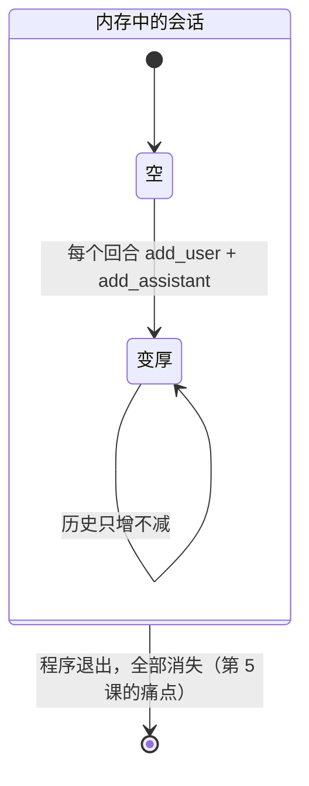
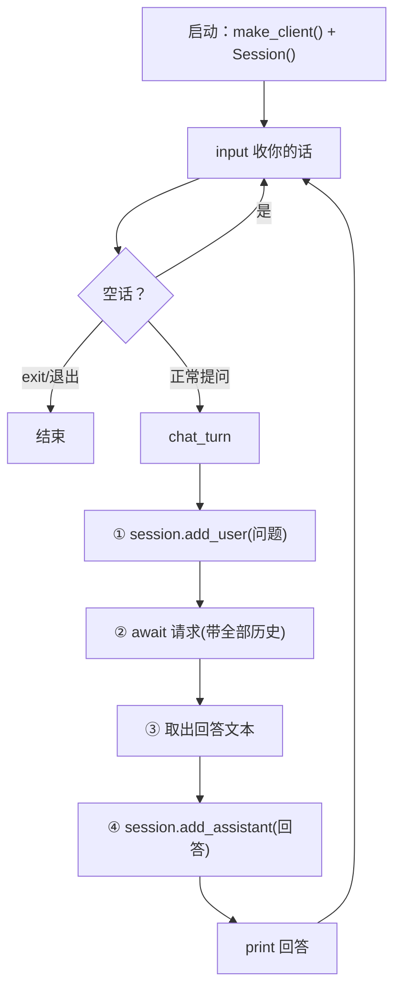
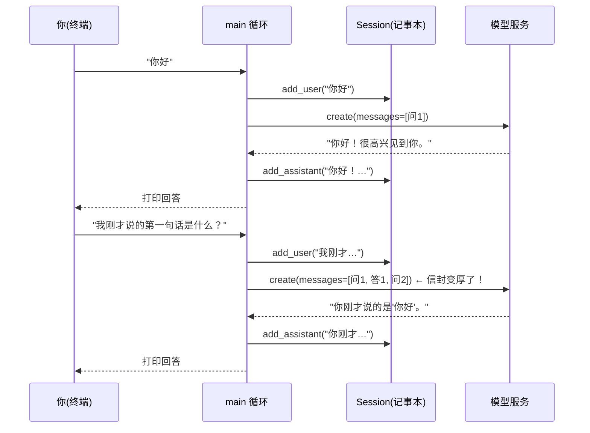

# 第 02 课：别忘了我——多轮对话与内存会话

## 1. 前言

上一课的结尾，我们留下了一只"金鱼"。

它能回答问题，但你只要追问一句"那为什么呢"，它就一脸茫然——因为每次调用，它只收到**一条**消息，上一轮你说过什么、它答过什么，全都随着上一次函数返回烟消云散了。用专业一点的话说：它是**无状态**的。

这一课的心愿很朴素：

> 我要连续地跟它聊，它得记得上文。

要实现它，思路其实只有一句话：**把历史消息一直带在身上，每次请求都重发给模型**。模型本身没有记忆，所谓"记得"，是我们每次都把整段对话重新念给它听。

这一课还要顺手做一件事：把代码从同步迁移到**异步**（async/await）。为什么是现在？因为接下来几课，我们的助手要学会"一边流式吐字、一边干活等待"这些需要异步的本事，趁现在整个项目只有三个函数、改动最便宜的时候完成这次改造，是代价最小的时机。等代码长到几千行再迁移，那才叫痛苦。

## 2. 主要内容

### 2.1 这节课做什么（文字版步骤）

1. 新建 `nanobot_st/session.py`：定义 `Session` 类——一个会话就是一个消息列表，提供 `add_user` / `add_assistant` 两个记录动作；
2. 改造 `nanobot_st/chat.py`：
   - 客户端从 `OpenAI` 换成 `AsyncOpenAI`，`chat_turn` 变成 async 函数；
   - 主角从 `ask_question`（只发一条）升级为 `chat_turn`（一个完整回合：提问入史 → 带全部历史请求 → 回答入史）；
   - `main` 变成聊天循环：你一句、我一句，直到输入 exit；
3. 升级假客户端：`create` 变异步，支持按剧本播放多份回答，并把每次请求的消息列表**当场快照**存档；
4. 测试：验证第二回合发出的请求确实带上了第一回合的问答（记忆的核心证据）；
5. 安装 `pytest-asyncio`，配置异步测试模式。

### 2.2 代码阅读链条（按这个顺序读）

**链条一：真实聊天（主链）**

```text
终端执行 uv run python -m nanobot_st.chat
→ chat.py 的 main() 先备好两样东西：make_client() 造的电话、Session() 造的记事本
→ 进入 while True 循环：input() 收你的一句话
→ chat_turn(client, session, question)
     第一步  session.add_user(question)      ——你的话记入历史（信封变厚）
     第二步  await client.chat.completions.create(model, messages=session.messages)
                                        ——把整个历史发给模型，await 挂起等待
     第三步  从响应三层取值得到 answer
     第四步  session.add_assistant(answer)   ——AI 的话也记入历史
     返回 answer → print 打印
→ 回到循环顶部，等你的下一句
```

**链条二：测试（假客户端链）**

```text
运行 pytest → FakeClient 带着"剧本"上场（scripted_answers 两份回答）
→ 第 1 回合 chat_turn：发出的 messages 快照存进 captured_calls[0]
→ 第 2 回合 chat_turn：发出的 messages 快照存进 captured_calls[1]
→ 断言：captured_calls[1] 的信封里 = [上一问, 上一答, 这一问] —— 记忆存在的铁证
```

### 2.3 流程总结（和上一课比多了什么）

上一课的链条是"一问 → 一答"的**直线**。本课做了两处升级：一是给链条加了**两个环节**（发出前先把提问入史、收到后把回答入史——历史信封的组装与回填）；二是把链条**首尾相接变成了循环**（聊天循环）。信封不再是一次性的，而是**一只越用越厚的信封**。这是"环节 + 循环"级别的演化，不动链条的主体（请求-响应那一段没变）。

### 2.4 拔高一下

本课出现了本项目第一种**状态**：`Session` 的消息列表。它住在内存里、随程序生死。更重要的设计思想是那句反直觉的真相——**AI 的"记忆"不在 AI 那里，在我们这边**：模型是无状态的，每次都是我们把完整历史重发一遍，它才"显得"记得。原项目 nanobot 里庞大的会话存储体系（第 5 课会见到它的 JSONL 版），根子上就是为这只"不断变厚的信封"找个可靠的家。

## 3. 技术要点

### 3.0 环境配置是基础

本课新增一个测试依赖（已安装，说明其来历）：

```bash
uv add --dev pytest-asyncio     # 让 pytest 能跑 async 测试函数
```

并在 `pyproject.toml` 的 `[tool.pytest.ini_options]` 里加了一行 `asyncio_mode = "auto"`——意思是"测试函数只要是 async def 就自动按异步跑"，不用在每个测试上贴标记。VS Code 的 Testing 面板用法不变：绿色 ▶ 照点，异步测试和同步测试长得一样。

### 3.1 坐标是指南针

```text
nanobot_st/
├── session.py   ★ 新增：数据的家（会话/历史）——纯数据对象，没有任何网络动作
└── chat.py      ★ 改造：引擎（回合制对话）——异步化 + 历史感知
tests/
├── test_chat.py    ★ 改造：假客户端升级（异步 + 剧本 + 快照）
└── test_session.py ★ 新增：纯数据对象的单元测试
```

横向看：`session.py`（存数据）与 `chat.py`（做事情）第一次分了家——数据与行为分离的最初形态。纵向看：`chat_turn` 是未来所有功能的必经之路（工具循环、上下文组装都会嵌在它身上）。

### 3.2 代码是中心

#### 文件一：`nanobot_st/session.py`（全文 22 行，先读它）

```python
"""内存会话：用一个消息列表记住当前这轮对话的全部历史。"""


class Session:
    """一个会话 = 一份不断变长的消息列表。

    它是 AI"记忆"的载体：每次请求把整个列表发给模型，
    模型看起来"记得上文"，其实是我们每次都把历史重发了一遍。
    注意：它只存在内存里，程序一退出就消失（第 5 课解决）。
    """

    def __init__(self):
        self.messages: list[dict] = []

    def add_user(self, text: str) -> None:
        """把用户说的话装进标准信封，追加到历史末尾。"""
        self.messages.append({"role": "user", "content": text})

    def add_assistant(self, text: str) -> None:
        """把 AI 的回答追加到历史末尾。"""
        self.messages.append({"role": "assistant", "content": text})
```

#### 文件二：`nanobot_st/chat.py`（主角是 chat_turn）

```python
"""和 AI 聊天：带着全部历史的异步对话。"""

import asyncio
import os

from openai import AsyncOpenAI

from nanobot_st.session import Session


def resolve_model() -> str:
    """从环境变量读取要用的模型名；没设置时报错并给出操作指引。"""
    model = os.environ.get("NANOBOT_ST_MODEL")
    if not model:
        raise RuntimeError(
            "还没有设置模型名。请先执行：export NANOBOT_ST_MODEL=deepseek-chat "
            "（或你所使用服务的模型名）"
        )
    return model


def make_client() -> AsyncOpenAI:
    """根据环境变量创建异步 OpenAI 客户端。

    用到的环境变量（openai SDK 会自动读取，无需手动传参）：
    - OPENAI_API_KEY  密钥
    - OPENAI_BASE_URL 服务地址；不设置就用 OpenAI 官方，
      设置成兼容服务的地址即可使用 DeepSeek、智谱、Ollama 等。
    """
    return AsyncOpenAI()


async def chat_turn(client: AsyncOpenAI, session: Session, question: str) -> str:
    """进行一个对话回合：把提问记入历史 → 带着全部历史请求模型 → 回答也记入历史。

    client:   由调用方传入的异步客户端（真实运行传 make_client() 的产物，
              测试时传 FakeClient，不花钱不碰网）。
    session:  本次对话的会话，历史就存在它身上。
    question: 用户这一回合的提问。
    """
    session.add_user(question)
    response = await client.chat.completions.create(
        model=resolve_model(),
        messages=session.messages,
    )
    answer = response.choices[0].message.content
    session.add_assistant(answer)
    return answer


async def main() -> None:
    """终端聊天入口：循环"你一句、我一句"，直到输入 exit 退出。"""
    client = make_client()
    session = Session()
    print("开始聊天吧（输入 exit 退出）")
    while True:
        question = input("你：").strip()
        if not question:
            continue
        if question in ("exit", "quit", "退出"):
            print("下次再聊～")
            break
        answer = await chat_turn(client, session, question)
        print(f"AI：{answer}")


if __name__ == "__main__":
    try:
        asyncio.run(main())
    except (KeyboardInterrupt, EOFError):
        print("\n下次再聊～")
```

#### 怎么读懂它（层次视角）

- `session.py` 的 `Session` 负责**保管历史**。它的方法 `add_user` / `add_assistant` 负责把一句白话装进标准信封（dict）追加到列表末尾——输入是字符串，输出无（改的是自己的列表）；
- `chat.py` 的 `chat_turn` 负责**一个完整回合**。它把"保管"委托给 `Session`（两次调用），把"通话"委托给 `client.chat.completions.create`（await 等待），自己只做编排：入史 → 请求 → 取答 → 入史 → 返回；
- `main` 负责**聊天循环**：备好 client 与 session，然后反复"收话 → 回合 → 打印"。它把回合逻辑委托给了 `chat_turn`；
- `resolve_model`、`make_client` 与上课相同，只是客户端换成了异步版。

#### 设计故事（为什么这么写）

- 为了让 AI"记得上文"，必须每次重发全部历史，所以引入了 `Session`——历史需要一个固定的存放处；
- 但历史要"边聊边长"，直接在 main 里操作裸列表会把"装信封"的格式细节洒得到处都是，所以给 Session 配了两个语义明确的动作（add_user / add_assistant）；
- 但是回合开始时问话必须先入史、结束时回答也必须入史（否则下一轮就缺一角），这个"必须成对发生"的纪律放在哪最稳？放在 `chat_turn` 内部——谁来回合，历史就自动完整，main 想忘都忘不掉；
- 为了异步迁移，`main` 需要有人"发动"异步世界，所以有了 `asyncio.run(main())`。
- 拟人化记忆：`Session` 是一位**一丝不苟的记事本**，双方说的每句话都按顺序记下、一个字不改；`chat_turn` 是**回合制传话员**，每回合把记事本整本复印一份念给 AI 听，听完把 AI 的话也记上。

#### 文件三：`tests/test_chat.py`（假客户端升级版）

FakeClient 三处升级见代码注释。核心测试：

```python
async def test_chat_turn_carries_history(monkeypatch):
    """验证：第二回合发出的请求带上了第一回合的问答，且两回合回答正确返回。"""
    monkeypatch.setenv("NANOBOT_ST_MODEL", "fake-model")
    client = FakeClient(scripted_answers=["你好！很高兴见到你。", "你刚才说的是'你好'。"])
    session = Session()

    first = await chat_turn(client, session, "你好")
    second = await chat_turn(client, session, "我刚才说的第一句话是什么？")

    assert first == "你好！很高兴见到你。"
    assert second == "你刚才说的是'你好'。"
    assert client.captured_calls[0]["messages"] == [
        {"role": "user", "content": "你好"},
    ]
    assert client.captured_calls[1]["messages"] == [
        {"role": "user", "content": "你好"},
        {"role": "assistant", "content": "你好！很高兴见到你。"},
        {"role": "user", "content": "我刚才说的第一句话是什么？"},
    ]
```

### 3.3 数据是着眼点（本课的灵魂）

同一只信封，两个时刻的厚度对比——这就是"记忆"的全部秘密：

第 1 回合发出的 `messages`：

```json
[
  { "role": "user", "content": "你好" }
]
```

第 2 回合发出的 `messages`：

```json
[
  { "role": "user", "content": "你好" },
  { "role": "assistant", "content": "你好！很高兴见到你。" },
  { "role": "user", "content": "我刚才说的第一句话是什么？" }
]
```

数据变形链（每回合）：

```text
"我刚才说的第一句话是什么？"        ← str，你的新问题
  → session.messages 追加后变厚     ← list[dict]，历史（活的、共享的）
  → 快照后随请求序列化为 JSON        ← HTTP 请求体
  → ChatCompletion 响应对象          ← SDK 反序列化
  → choices[0].message.content       ← str，AI 的新回答
  → session.messages 再追加          ← 历史又厚一格
```

**一个必须建立的数据直觉**：`session.messages` 是一个"活的"列表对象。`chat_turn` 发给 SDK 的是它的引用（不是复印件）；SDK 当场序列化成 JSON 发走，所以之后列表再变厚也不影响已发出的请求。但**我们的假客户端是把它存起来慢慢看的**，所以必须自己动手快照（`[dict(m) for m in messages]`），否则第 2 回合的追加会"倒灌"改写第 1 回合的存档——这是引用语义（可变对象共享）最生动的教材。

### 3.4 状态是重要视角

本课诞生了项目第一个有生命周期的对象。Session 的状态流转：



- 谁创建状态：`main` 启动时 `Session()`；
- 谁修改状态：`chat_turn`（经由 add_user / add_assistant）；
- 谁读取状态：每次请求（整个列表发给模型）、测试断言；
- 状态存在哪：**只有内存**——这是刻意保留的缺陷，第 5 课的驱动力。

### 3.5 流程图是重要工具

聊天循环全景（本课把上节课的直线链接成了环）：



两个回合的时序（看清历史如何变厚）：



### 3.6 细节技术点

- **async / await / asyncio.run（本课最重要）**：大白话——await 的意思是"这件事要等（网络往返），等的时候**把我挂起、让别的活先干**，好了再叫我"。`async def` 标记的函数叫协程函数，调用它不会立刻执行，而是返回一个"待办单"，必须交给 `await` 或 `asyncio.run` 才真正运转；`asyncio.run(main())` 是异步世界的"点火钥匙"，在整个程序只有一处（入口）。当前程序里其实没有"别的活"可干，异步的好处要等到流式输出（第 7 课）和子代理（第 12 课）才真正兑现——现在改造是为了让将来不必推倒重来；
- **同步与异步 SDK 是双胞胎**：`from openai import OpenAI` 与 `AsyncOpenAI` 接口几乎一样，区别仅是异步版的调用要 await。原项目整个是异步写的，我们从此对齐；
- **try / except 捕获多个异常**：`except (KeyboardInterrupt, EOFError)` 一个括号捕获两种——`KeyboardInterrupt` 是你按 Ctrl+C，`EOFError` 是输入流关闭（Ctrl+D 或管道结束），两者都当作"想走了"优雅收尾；
- **while True + break + continue**：无限循环的三件套：`continue` 跳回循环顶部（空输入就重新问）、`break` 跳出循环（exit 命令）、Ctrl+C 从外部打断；
- **f-string**：`print(f"AI：{answer}")` 里 `f` 前缀开启"字符串内嵌变量"，`{answer}` 会被替换成变量值——比用 + 拼接字符串清爽得多；
- **可变列表的引用共享与快照**：详见 3.3 末段。一句话版：**传的是"地址"不是"复印件"**，想留档必须自己拷贝；
- **pytest-asyncio 的 auto 模式**：async 测试函数自动被识别运行，和同步测试混排无感；
- **input() 在异步程序里的妥协**：input 是同步阻塞的（等着你敲键盘时整个事件循环停摆）。当前单用户终端无所谓，先容忍；到第 9 课做正式终端时再议。

## 4. 测试与验收

### 测试一：chat_turn 带着历史（tests/test_chat.py）

- **测什么**：两个回合各自发出的 messages 内容。
- **为什么测**：这是"AI 有记忆"的直接证据——不验证它，多轮对话就是自我安慰；
- **输入**：两回合提问"你好"、"我刚才说的第一句话是什么？"，剧本回答两份；
- **预期**：第 1 次请求只含第 1 问；第 2 次请求含 [问1, 答1, 问2] 三条；两回合返回值正确；
- **证明了什么**：历史在回合间正确累积并完整重发——记忆机制成立。

### 测试二：回合后历史完整入档（tests/test_chat.py）

- **测什么**：一个回合结束后 session.messages 的内容。
- **预期**：恰好 [问, 答] 两条，顺序正确；
- **证明了什么**：回答确实回填进了历史，不是"用完即弃"。

### 测试三、四：Session 单元测试（tests/test_session.py）

- **测什么**：add_user / add_assistant 的记录格式与顺序；新会话从空开始；
- **证明了什么**：数据对象自身行为正确（它是记忆的最终载体）。

### 本课验收清单

- [ ] `uv run pytest -v` 四条测试全绿；
- [ ] 真实运行聊天：连续追问（如先问"用一句话介绍黑洞"，再问"我刚才问了你什么？"），AI 能接住第二问；
- [ ] 能说出：AI 的"记忆"靠什么实现（每次重发全部历史）；
- [ ] 能说出：为什么假客户端要"快照"消息列表（引用共享会倒灌）；
- [ ] 完成 git commit。

## 5. 总结

这一课之后，助手从金鱼变成了**有短期记忆的聊天伙伴**：`Session` 在内存里养着一只不断变厚的信封，`chat_turn` 每个回合"入史 → 重发 → 回填"，聊天循环让它可以一直聊下去。我们还趁着项目最小的时候完成了异步改造，为流式输出和并发铺好了地基。

但马上会撞上三个新问题：

1. **它过夜就失忆**：聊天再久，Ctrl+C 一退出，记事本连本带页消失——第 5 课把历史存进文件；
2. **它只会说话不会做事**：问"现在几点"依旧只能道歉——第 3 课给它第一双手（工具调用），那是本课程的核心一课；
3. **信封会无限变厚**：聊一百轮后，每次都要重发全部历史，又贵又终会超出模型上限——第 6 课学习裁剪。

下一课，我们解决第二个问题——给 AI 一双手。

---
*配套文件：`nanobot_st/session.py`、`nanobot_st/chat.py`（改造）、`tests/test_chat.py`（升级）、`tests/test_session.py`（新增）*
