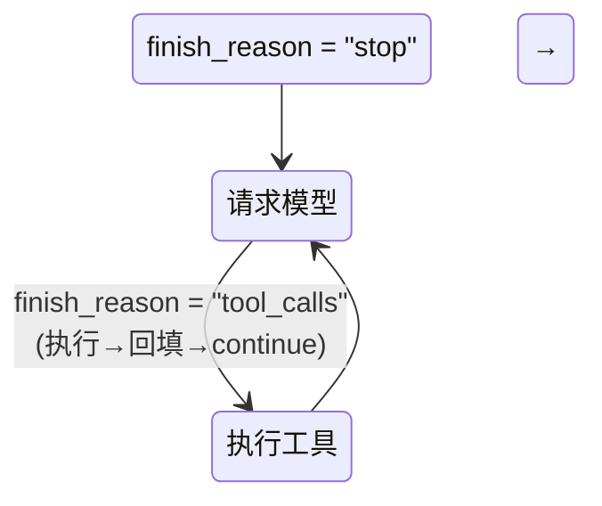
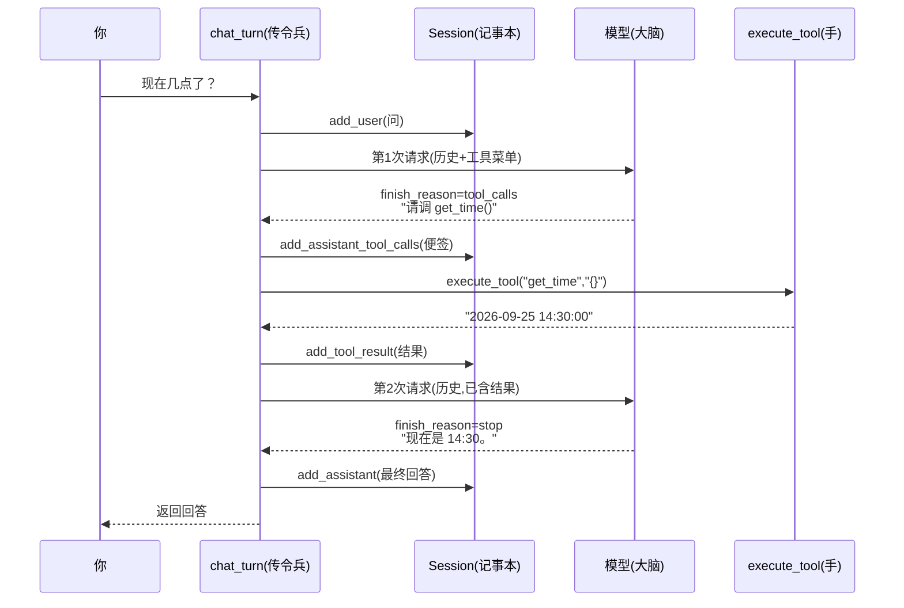
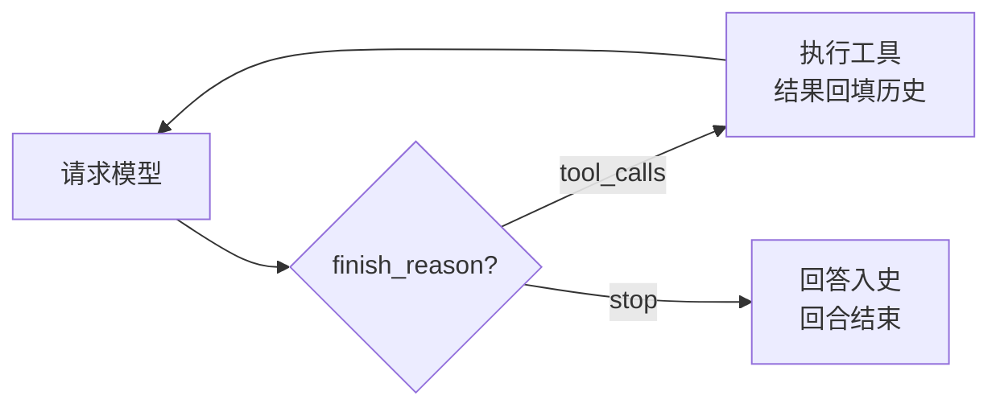

# 第 03 课：给 AI 一双手——第一个工具调用

## 1. 前言

先回收上一课的两个思考题，它们正好是今天的地基：

**AI 的"记忆"存在哪？**——不在 AI 那边。模型本身是无状态的，所谓记得，是我们每次把完整历史重发一遍。今天工具的执行结果要被模型"看到"，靠的仍然是同一招：**把结果追加进历史、再发一遍**。

**为什么假客户端要快照消息列表？**——因为传的是"地址"不是"复印件"，不拷贝的话后续追加会倒灌改写存档。今天的历史里会混入工具消息，这只"活的信封"更活跃了，快照依然功不可没。

然后，说说今天的痛点。

上两节课的助手已经能聊天、能记事，但它**只会说话，不会做事**。你问它"现在几点了"，它会一本正经地道歉："抱歉，我无法获取实时时间。"——它不是不聪明，是被关在 API 后面：**大脑泡在营养液里，看得见你打的字，摸不到真实世界**。

这一课的心愿：

> 让它先查到真实时间，再回答你。

做法是给它第一双手：一个我们自己写的 Python 函数 `get_time()`，通过"工具调用"协议交给模型使用。这一课之后，你的程序就从"聊天机器人"升级成了 **agent（能做事的智能体）**——这也是原项目 nanobot 名字里 "bot" 之外真正的灵魂所在。整个课程最重要的一课，就是今天。

## 2. 主要内容

### 2.1 这节课做什么（文字版步骤）

1. 新建 `nanobot_st/tools.py`：定义第一个工具——`get_time()` 函数本体、`GET_TIME_SCHEMA` 说明书（JSON Schema 格式，告诉模型这个工具叫什么、干什么、要什么参数）、`TOOLS` 工具菜单、`execute_tool()` 分发员（按名字找工具执行）；
2. 给 `Session` 记事本教会两种新消息的记法：`add_assistant_tool_calls`（"AI 请求调用工具"）、`add_tool_result`（工具结果，必须带配对 id）；
3. 改造 `chat_turn`：把"一次请求"变成**工具循环**——模型要工具就执行、结果回填进历史、再请求，直到它给出最终文本；同时加一道 10 轮保险丝，防止模型"工具成瘾"烧钱；
4. 假客户端升级成"剧组"：按剧本依次播放多幕响应，支持"要工具"和"最终回答"两种戏码；
5. 测试：验证完整工具回合的消息序列（问 → 请求调用 → 工具结果 → 最终回答）与两次请求的内容。

### 2.2 代码阅读链条（按这个顺序读）

**链条一：带工具的一个回合（本课主链，重点！）**

```text
你问"现在几点了？"
→ chat_turn：session.add_user(问题)
→ 第 1 次请求：create(messages=历史, tools=TOOLS)   ← 多带了工具菜单
→ 模型响应：finish_reason="tool_calls"，说"请帮我调 get_time()"
→ chat_turn 第一步：把"调用请求"转成 dict 信封，session.add_assistant_tool_calls(...)
→ chat_turn 第二步：execute_tool("get_time", "{}")
                      → json.loads 解析参数 → 调 get_time() → 返回 "2026-09-25 14:30:00"
                   session.add_tool_result("call_1", "get_time", 结果)
→ chat_turn 第三步：continue——带着新历史发起第 2 次请求
→ 模型响应：finish_reason="stop"，"现在是 2026-09-25 14:30:00。"
→ session.add_assistant(最终回答) → return
```

**链条二：不带工具的回合（上一课的直线，如今是循环的特例）**

```text
你问"你好" → 第 1 次请求（同样带工具菜单）
→ 模型发现不需要工具：finish_reason 直接就是 "stop"
→ add_assistant(回答) → return（循环只跑了一圈）
```

**链条三：测试（剧组链）**

```text
pytest → FakeClient 剧本两幕：[要工具, 最终回答]
→ 第 1 幕被 create 播放 → 断言 captured_calls[0]["tools"] == 工具菜单
→ 真工具被真执行（结果 19 字符）
→ 第 2 次请求的快照里，断言 messages[2] 是配对的 tool 结果
→ 断言 session 最终四种角色各就各位
```

### 2.3 流程总结（和上一课比多了什么）

上一课的循环是"你一句我一句"的**外层循环**，每一回合内部仍是"请求→回答"的直线。本课在**回合内部**长出了一个**环**：请求 →（要工具？→ 执行 → 回填 → 再请求）\* → 回答。这是一次"循环里加环"级别的演化。从此"一个回合"不再等于"一次 API 调用"——可能两次、三次、十次，全看模型需要几只手。这个环，就是所有 agent 框架的心脏；原项目 2500 行的 `AgentLoop`、1400 行的 `AgentRunner`，心脏都是这一个 while 环。

### 2.4 拔高一下

这个环让三种角色第一次同台：**模型是大脑**（它只做决策——"我要调 get_time"，但从不自己执行任何东西）；**工具是手**（普通的 Python 函数，没有智能）；**历史是工作记忆**（大脑与手之间的全部通信，都靠往历史里写消息、再重发）。分清楚"谁决策、谁执行、在哪里交换信息"，你就抓住了 agent 架构的本质。

协议层面，今天用到的 "tools + tool_calls"（术语叫 **function calling**）是继 `messages` 信封之后的第二块行业事实标准——DeepSeek、智谱、Claude、Gemini 全都讲这套话。学会了它，你的工具可以喂给任何一家模型。

## 3. 技术要点

### 3.0 环境配置是基础

本课**零新依赖**：`json` 和 `datetime` 都是 Python 标准库（自带，不用安装）。测试照旧：VS Code 左侧 Testing 面板绿色 ▶，或终端 `uv run pytest -v`。

### 3.1 坐标是指南针

```text
nanobot_st/
├── tools.py   ★ 新增：手（工具定义 + 说明书 + 分发员）——独立模块，未来的"工具间"
├── chat.py    ★ 改造：心脏（chat_turn 长出工具循环）
└── session.py ★ 小改：记事本学会记两种新消息
tests/
├── test_chat.py   ★ 升级：假客户端变成"剧组"（剧本化响应）
└── test_tools.py  ★ 新增：工具自身单元测试
```

横向分工此刻是：`session.py` 管数据、`tools.py` 管能力、`chat.py` 管编排——数据/能力/编排三分离，这个雏形会长成整个项目的骨架。

### 3.2 代码是中心

#### 文件一：`nanobot_st/tools.py`（全文 34 行，先读它）

```python
"""内置工具：AI 的"双手"。本课先只有一个——获取当前时间。"""

import json
from datetime import datetime

# 工具说明书（OpenAI tools 格式）：告诉模型"有哪些工具可用、怎么用"。
# parameters 用 JSON Schema 描述参数——get_time 不需要参数，所以是个空对象。
GET_TIME_SCHEMA = {
    "type": "function",
    "function": {
        "name": "get_time",
        "description": "获取当前的日期和时间。当用户询问现在几点、今天是几号时使用。",
        "parameters": {"type": "object", "properties": {}, "required": []},
    },
}

# 本次对话向模型开放的全部工具清单（发给模型的"工具菜单"）
TOOLS = [GET_TIME_SCHEMA]


def get_time() -> str:
    """返回当前本地时间，格式如 2026-09-25 14:30:00。"""
    return datetime.now().strftime("%Y-%m-%d %H:%M:%S")


def execute_tool(name: str, arguments_json: str) -> str:
    """按工具名执行对应函数，返回结果文本（注意：这个文本是给模型看的）。

    arguments_json 是模型给的参数，永远是一段 JSON 字符串（即使没参数也是 "{}"），
    必须先解析成 dict 才能使用。
    """
    arguments = json.loads(arguments_json)
    if name == "get_time":
        return get_time(**arguments)
    return f"未知工具：{name}"
```

#### 文件二：`nanobot_st/session.py`（新增两个方法，其余不动）

```python
    def add_assistant_tool_calls(self, tool_calls: list[dict]) -> None:
        """把"AI 请求调用工具"这条消息记入历史（role 仍是 assistant，但带 tool_calls）。"""
        self.messages.append({"role": "assistant", "content": "", "tool_calls": tool_calls})

    def add_tool_result(self, tool_call_id: str, name: str, result: str) -> None:
        """把一条工具执行结果记入历史。

        tool_call_id 必须与"请求调用"时的 id 一致——协议靠这个 id
        把"哪一次请求"和"哪一份结果"配成一对。
        """
        self.messages.append(
            {"role": "tool", "tool_call_id": tool_call_id, "name": name, "content": result}
        )
```

#### 文件三：`nanobot_st/chat.py` 的 `chat_turn`（本课心脏，其余函数不动）

```python
MAX_TOOL_ROUNDS = 10   # 一回合内最多让模型要几轮工具：防止无限循环白烧钱


async def chat_turn(client: AsyncOpenAI, session: Session, question: str) -> str:
    """进行一个对话回合（其中可能包含多轮工具调用）。

    工具循环（agent 的心脏）：
    请求模型 → 模型要工具就执行并把结果回填、再请求模型 → 直到给出最终回答。
    """
    session.add_user(question)
    for _ in range(MAX_TOOL_ROUNDS):
        response = await client.chat.completions.create(
            model=resolve_model(),
            messages=session.messages,
            tools=TOOLS,                    # ← 新增：把工具菜单一起发上去
        )
        choice = response.choices[0]
        if choice.finish_reason == "tool_calls":
            # 第一步：把"AI 请求调用工具"原样记入历史
            #（SDK 给的是对象，先转成标准 dict 信封，历史里存的都是信封）
            tool_calls = [
                {
                    "id": tc.id,
                    "type": "function",
                    "function": {"name": tc.function.name, "arguments": tc.function.arguments},
                }
                for tc in choice.message.tool_calls
            ]
            session.add_assistant_tool_calls(tool_calls)
            # 第二步：逐个执行工具，把每份结果也记入历史
            for tc in tool_calls:
                result = execute_tool(tc["function"]["name"], tc["function"]["arguments"])
                session.add_tool_result(tc["id"], tc["function"]["name"], result)
            # 第三步：带着工具结果把全部历史再发给模型，看它还有什么要说的
            continue
        # finish_reason == "stop"：模型给出最终文本回答，回合结束
        session.add_assistant(choice.message.content)
        return choice.message.content
    raise RuntimeError(f"模型连续 {MAX_TOOL_ROUNDS} 轮请求工具，已强制停止本回合")
```

#### 怎么读懂它（层次视角）

- `tools.py` 负责**提供能力**。`get_time` 是干活的手；`GET_TIME_SCHEMA` 是写给模型看的说明书；`execute_tool` 是分发员——输入工具名 + JSON 参数串，输出结果文本，把"找哪个函数、怎么传参"委托给了 `if name == ...` 分支和 `json.loads`；
- `session.py` 的 `Session` 继续**保管历史**，只是新学了两种信封的记法；
- `chat.py` 的 `chat_turn` 负责**编排心跳**。它把"执行工具"委托给 `execute_tool`，把"记录"委托给 `Session`，自己只掌握方向盘：看 `finish_reason` 决定"再来一圈"还是"收工"。

#### 设计故事（为什么这么写）

- 为了让模型知道"有手可用"，必须把说明书一起发上去，所以请求多了 `tools=TOOLS` 参数；
- 模型表达"我要用工具"的方式是返回 `tool_calls`，但**协议要求这条请求必须先回填进历史、结果才能作为回复出现**——否则模型第二次请求时根本不知道自己要过什么（它无状态！），所以第一步先把调用请求入史；
- 但模型和函数之间语言不通：模型说 JSON 字符串、函数要 Python 参数，所以中间需要 `execute_tool` 这个翻译分发员；
- 结果拿到了，模型怎么"看到"？没有别的通道——**把结果作为 `role:"tool"` 消息入史、整个历史再发一遍**。这就是 continue 的意义；
- 为了防止模型陷入"要工具-要工具-要工具"的死循环烧钱，所以 `for _ in range(MAX_TOOL_ROUNDS)` 圈住它，超圈强制报错。
- 拟人化记忆：模型是**营养液里的大脑**，只会写便签（"请调 get_time"）从不亲自干活；`execute_tool` 是**听令的双手**，拿到便签立刻干活递结果；`chat_turn` 是**传令兵兼心跳**，大脑便签 → 手 → 结果便签 → 再递回大脑，循环往复直到大脑写下最终答案。

#### 文件四：`tests/test_chat.py`（假客户端升级为"剧组"）

FakeClient 现在接受"剧本"（一列 dict），每一幕两种戏码：`stop`（给最终回答）或 `tool_calls`（请求调工具）。八个小假类把剧本 dict 搭建成与真实 SDK 一模一样的嵌套对象（response → choices → message → tool_calls → function）。核心测试 `test_chat_turn_executes_tool_then_answers`（[tests/test_chat.py:85](/home/shitanli/ln_rebuild_zcode/nanobot/nanobot-st/tests/test_chat.py#L85)）验证整条链路。

### 3.3 数据是着眼点（本课的灵魂，仔细看）

一次"现在几点了"回合结束后，`session.messages` 里躺着的**完整四条**：

```json
[
  { "role": "user",      "content": "现在几点了？" },

  { "role": "assistant", "content": "",
    "tool_calls": [
      { "id": "call_abc123", "type": "function",
        "function": { "name": "get_time", "arguments": "{}" } } ] },

  { "role": "tool", "tool_call_id": "call_abc123",
    "name": "get_time", "content": "2026-09-25 14:30:00" },

  { "role": "assistant", "content": "现在是 2026-09-25 14:30:00。" }
]
```

**三种容易混淆的数据形态，一次说清**：

1. **assistant 消息的两种长相**：普通回答（`content` 有字、无 `tool_calls`）vs 工具请求（`content` 空、`tool_calls` 有货）。角色相同，含义完全不同——前者是"说给人听"，后者是"写给手执行的便签"；
2. **`arguments` 是 JSON 字符串，不是 dict**：注意上面 `"arguments": "{}"` 带引号——协议里参数永远是一段**序列化好的 JSON 文本**（因为要以文本形式塞进消息里传输）。所以执行前必须 `json.loads`。这是新手最常踩的坑：直接把它当 dict 用会全盘报错；
3. **`tool_call_id` 是配对暗号**：第 3 条 tool 消息必须回引第 2 条里某个调用的 `id`。多条工具调用时（模型可以一次要好几只手），全靠暗号配对，谁的结果归谁——丢了暗号，整个历史就不合法，API 会拒收。

**两次请求对比**（模型凭什么"看到"结果）：

```text
第 1 次请求 messages：[user 问]
第 2 次请求 messages：[user 问, assistant 便签, tool 结果]   ← 结果就藏在这
```

没有魔法通道，还是那招：**写入历史，整个重发**。

### 3.4 状态是重要视角

本课最重要的新状态机：`finish_reason`——工具循环的方向盘。



- **谁产生**：模型服务（它决定这轮是"要工具"还是"说话"）；
- **谁消费**：`chat_turn` 的 if 分支——整个循环只有这一个判断点；
- **存在哪**：每轮响应里，用完即弃（不进历史，历史里只有消息）；
- **不变量**：`role:"tool"` 消息必须紧跟在含对应 `id` 的 assistant 消息之后，顺序与配对都不能乱——第 6 课做历史截断时，这个不变量会成为头号保护对象。

### 3.5 流程图是重要工具

带工具回合的全景时序：



心脏本身（抽象掉所有角色，只看循环结构）：



### 3.6 细节技术点

- **JSON Schema**：`parameters` 字段里那套 `{"type": "object", "properties": {...}}` 是一种"用 JSON 描述 JSON 长什么样"的规范——类型、属性、必填项。模型读说明书全靠它。将来工具带参数时（比如"算数工具"要两个数字），`properties` 里就要声明每个参数的类型和说明，写得越清楚模型传参越准；
- **`json.loads` / `json.dumps`**：一对反义词——loads 把 JSON **字符串**变成 Python 对象（dict/list）；dumps 反向。今天的 `arguments_json` 必须先 loads；
- **`**arguments` 解包**：`get_time(**arguments)` 把 dict 的键值对拆成关键字参数喂给函数——`{"a": 1}` 变成 `f(a=1)`。空 dict 就是什么都不传。这样无论工具要几个参数，分发员一行都写得通；
- **`datetime.now().strftime(...)`**：strftime = string format time，把时间对象按格式串排版：`%Y` 四位年、`%m` 月、`%d` 日、`%H` 时、`%M` 分、`%S` 秒；
- **列表推导式**：`[ {...} for tc in choice.message.tool_calls ]` 一行完成"遍历 + 逐个转换 + 收集成列表"，是 Python 最常用的紧凑写法。等价于一个 for 循环 + append。SDK 给的是对象、历史要的是 dict，这一行就是"对象转信封"的传送带；
- **`for _ in range(N)` 里的下划线**：`_` 是"这个变量我不用"的约定俗成写法。循环只用来计数圈数；
- **continue 在 for 里**：跳过本轮剩余代码、直接进入下一圈——这里是"带着新历史重新请求"；
- **防御性返回**：`execute_tool` 遇到不认识的工具名不抛异常，而是返回一句"未知工具：xxx"的**文本给模型看**——模型读了自己写的错字，下一轮通常就改对了。把错误当数据递回去，比让程序崩溃优雅得多（原项目对工具错误也这么处理）；
- **保险丝**：`MAX_TOOL_ROUNDS = 10` 圈住循环。真实模型偶尔会对某个工具"上瘾"（拿到结果还要、要了还要），没有保险丝就是无限 API 账单。

## 4. 测试与验收

### 测试一：完整工具回合（tests/test_chat.py）

- **测什么**：从"要工具"到"最终回答"的整条链路及两次请求的内容；
- **为什么测**：这是 agent 的心脏手术，任何一环（菜单没带、便签没记、工具没执行、结果没回填、二次请求没发出）都会让 agent 变回聊天机器人；
- **输入**：剧本两幕 [要 get_time, 最终回答]，提问"现在几点了？"；
- **预期**：第 1 次请求带工具菜单；第 2 次请求的历史里第 3 条是配对正确（`tool_call_id="call_1"`）的 tool 结果，且内容是真实执行产生的 19 字符时间串；回合后历史角色序列为 user/assistant/tool/assistant；返回最终回答文本；
- **证明了什么**：工具真的被执行了（不是模型瞎编时间）、结果真的进了历史、模型真的能在下一轮看到它——心脏完好。

### 测试二：普通回合不受影响（tests/test_chat.py）

- **测什么**：不需要工具的对话仍是"一次请求直接回答"；
- **预期**：captured_calls 恰好 1 次；历史只有 [user, assistant]；
- **证明了什么**：新循环没有破坏旧能力（回归测试的价值：每加新功能，顺手确认旧的没坏）。

### 测试三~五：工具单元测试（tests/test_tools.py）

- **测什么**：`get_time` 输出格式；`execute_tool` 按名分发（含空参数 JSON 解析）；未知工具名的防御性返回；
- **证明了什么**：手本身可靠，分发员不认识命令也不崩溃。

### 本课验收清单

- [ ] `uv run pytest -v` 七条测试全绿；
- [ ] 真实运行：问"现在几点了？"，AI 回答的时间与你的手表一致；再问个普通问题确认聊天能力还在；
- [ ] 能画出/说出带工具回合的四条消息序列（不看资料）；
- [ ] 能回答：模型自己"执行"了工具吗？（没有——它只是请求，执行永远在我们这边）；
- [ ] 能说出 `tool_call_id` 是干什么用的；
- [ ] 完成 git commit。

## 5. 总结

这一课，助手第一次摸到了真实世界：`tools.py` 提供了手（get_time + 说明书 + 分发员），`chat_turn` 长出了心脏（工具循环），`Session` 学会了记便签和结果。请求-响应的直线，从此变成"请求 →（要工具 → 执行 → 回填）\* → 回答"的环。**从今天起，"一个回合"等于"若干次 API 调用 + 若干次函数执行"**——这就是 agent 的心跳。

同时埋下了下一个真实痛点，下一课的主角：

> 现在只有一个工具，一切都很整洁。但如果我想加第二个（算数）、第三个（随机数）呢？

看看今天的代码：加一个工具，要改 `tools.py` 里**三处**——写函数、写 schema、往 `execute_tool` 加一个 if 分支（`TOOLS` 清单还得添一笔，算四处）。工具一多，这四处的维护就会开始互相绊脚。第 4 课，我们让"加一个工具"变成"只写一个类"——那将是本课程第一次**由痛点逼出来的抽象**。

另一个留给未来专课的问题：工具执行失败了怎么办？（网络工具超时、文件不存在……）原项目有完整的错误分类与重试体系，第 8 课见。

---
*配套文件：`nanobot_st/tools.py`（新增）、`nanobot_st/chat.py`（心脏改造）、`nanobot_st/session.py`（两个新方法）、`tests/test_chat.py`（剧组升级）、`tests/test_tools.py`（新增）*
