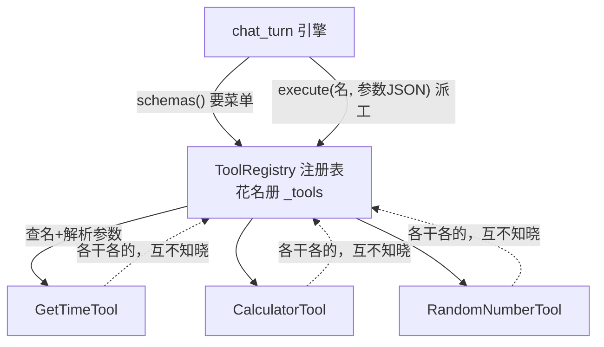
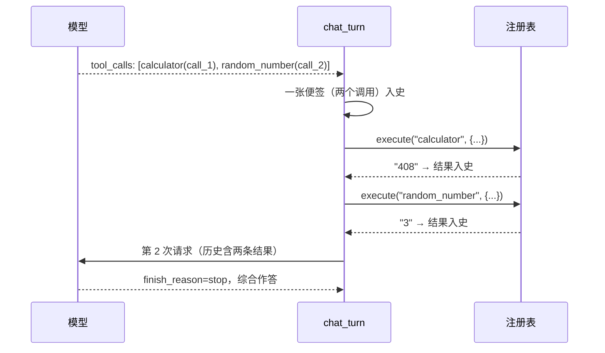

# 第 04 课：工具多起来——工具注册表

## 1. 前言

先对上一课思考题的答案（已在聊天中讲过，这里留档）：

1. **模型自己没有执行任何东西**。它只返回一张"便签"（`tool_calls` 请求），真正的执行发生在我们进程里。模型是大脑，我们是身体——这个分工是 agent 安全性的根基（能力边界永远在服务端手里）；
2. **一轮要两只手时**，历史顺序是 `[user 问, assistant 便签(两个调用), tool 结果A, tool 结果B]`，每个结果靠自己的 `tool_call_id` 回引便签里对应的调用。

然后，今天的痛点来了。

你用了一天上完的助手，很快就不满足了：让它算 `348 × 27`，它心算给你一个错答案（大数字乘法是语言模型的经典弱项）；跟它玩桌游想掷个骰子，它只能"假装"随机。于是你想加两个新工具：**计算器**和**掷骰子**。

动手前先打开上一课的 `tools.py` 数一数，每加一个工具要动几处：

```text
① 写一个函数（get_time 旁边再加 calculator）
② 写一份 schema 说明书
③ 往 TOOLS 清单里添一行
④ 往 execute_tool 的 if/elif 里加一个分支
```

四个工具就是十六处互相牵连的修改，漏掉任何一处就是 bug（比如忘了加 TOOLS，模型根本不知道有这个工具；忘了加 if，工具永远"未知"）。工具会是这个项目增长最快的部分（原项目有 20+ 个内置工具外加 MCP 动态工具），按这个方式长下去不可维护。

这一课的目标只有一句话：

> **加一个工具的成本，从"改四处"降到"写一个类"。**

这是本课程第一次真正意义上的**重构**：行为不变（聊天、工具循环、多轮记忆全都照旧），结构变好（工具的定义方式换了一套）。你还会第一次写下 `ABC`（抽象基类）——但注意，它不是我们从设计模式书里抄来的，是被上面那四处重复**逼**出来的。

## 2. 主要内容

### 2.1 这节课做什么（文字版步骤）

1. 把 `tools.py` 单文件升级为 `tools/` 包：
   - `base.py`：定义 `Tool` 抽象基类（name / description / parameters / execute 四件套）和 `ToolRegistry` 注册表（登记工具、生成菜单、按名分发、解析参数、防御坏输入）；
   - `get_time.py` / `calculator.py` / `random_number.py`：三个工具各住一个文件，每个都是一个小小的 Tool 子类；
   - `__init__.py`：`builtin_registry()` 组装"出厂标配"工具箱，并造出全局共用的 `REGISTRY`；
2. 删除旧 `tools.py`（连同 if/elif 和手写 TOOLS 清单——它们被注册表取代了）；
3. `chat.py` 只改两行：`tools=REGISTRY.schemas()`（菜单问注册要）、执行交给 `REGISTRY.execute(...)`；
4. 测试升级：验证菜单自动生成、带参数工具正确分发、一轮两只手按序回填、坏输入温柔拦截。

### 2.2 代码阅读链条（按这个顺序读）

**链条一：一个工具类的自述（先看最小的）**

```text
tools/get_time.py 的 GetTimeTool(Tool)
  → 填四个类属性/方法：name="get_time"、description、parameters、execute()
  → 结束。它的说明书和执行能力从此"随身携带"
```

**链条二：注册表如何生产菜单与分发（本课核心）**

```text
tools/__init__.py 的 builtin_registry()
  → registry.register(GetTimeTool())  …逐个登记三个工具
  → chat_turn 请求前：REGISTRY.schemas()
      → 遍历 _tools.values()，把每个工具的类属性拼装成标准说明书 dict
  → 模型返回 tool_calls 后：REGISTRY.execute("calculator", '{"a":12,...}')
      → self.get("calculator") 按名查到工具对象（dict 查找，替代 if/elif）
      → json.loads 解析参数 → tool.execute(a=12, b=34, operator="*") → "408"
```

**链条三：一轮两只手（多工具回合，读测试看证据）**

```text
剧本第 1 幕：模型同时要 calculator(call_1) 和 random_number(call_2)
→ chat_turn 第一步：一张便签带两个调用入史
→ 第二步：for 循环逐个 REGISTRY.execute → 两份结果按 call_1、call_2 顺序入史
→ 第三步：continue 带着两条结果再请求 → 模型综合两份结果给最终回答
```

### 2.3 流程总结（和上一课比多了什么）

特别的一课：**主链的形状一点没变**——请求 → 看方向盘 → 执行 → 回填 → 再请求，还是上一课那个环。变的是环上"工具"这个环节的**生产方式**：从"函数 + 手写说明书 + 手维护清单 + if/elif 分发"四件套，换成"一个自带说明书与执行力的类 + 注册表统一管理"一件套。用你的话说：没有加链条、没有加分支，是**给一个环节换了更高效的零件**——这叫重构（行为不变、结构变好），和"加功能"是两种不同性质的改动，git 里值得分成不同的 commit。

### 2.4 拔高一下

这次重构让代码获得了一种宝贵性质，工程上叫**对扩展开放、对修改关闭**（开闭原则的直觉版）：加第 N 个工具 = 新建一个文件 + 登记一行，主流程一个字不改。注册表这种"登记-查找"结构在业界叫 **Registry 模式**；而 `Tool(ABC)` 是我们第一次用**抽象基类**约定"所有工具必须长什么样"——注意它的出场顺序：先有第 3 课能跑的 if/elif，再有今天的痛点，抽象才落地。原项目里你能找到几乎同构的 `Tool`(ABC)、`ToolRegistry`、`ToolLoader`，将来接 MCP 动态工具时，它们也只是"再往注册表里登记一批"而已。

## 3. 技术要点

### 3.0 环境配置是基础

零新依赖（`abc`、`random` 都是标准库）。测试照旧：VS Code Testing 面板或 `uv run pytest -v`。

### 3.1 坐标是指南针

```text
nanobot_st/
├── tools/            ★ tools.py 长成了包（文件→包：项目长大的正常方式）
│   ├── __init__.py   组装出厂工具箱（builtin_registry + 全局 REGISTRY）
│   ├── base.py       基类 Tool(ABC) + 注册表 ToolRegistry —— 体系的"宪法"
│   ├── get_time.py   工具①（无参数）
│   ├── calculator.py 工具②（带参数 + enum 约束）
│   └── random_number.py 工具③（带参数）
├── chat.py           ★ 只改两行：菜单与分发都问注册表要
└── session.py        （本课未动）
```

### 3.2 代码是中心

#### 文件一：`tools/base.py`（体系宪法，全文 68 行，本课核心）

```python
"""工具基类与注册表：加一个新工具 = 新建一个类文件 + 注册一行。"""

import json
from abc import ABC, abstractmethod


class Tool(ABC):
    """所有工具的抽象基类：一份"自带说明书"的能力。

    子类只要填好四样东西：name（工具名）、description（说明）、
    parameters（参数的 JSON Schema）、execute（真正干活的函数），
    注册表就能自动生成工具菜单、自动按名分发——不再需要 if/elif。
    """

    name: str = ""
    description: str = ""
    parameters: dict = {"type": "object", "properties": {}, "required": []}

    @abstractmethod
    def execute(self, **kwargs) -> str:
        """执行工具，返回结果文本（给模型看）。参数由注册表解析后按关键字传入。"""


class ToolRegistry:
    """工具注册表：登记所有工具，统一提供"菜单"与"按名分发"两样服务。"""

    def __init__(self):
        self._tools: dict[str, Tool] = {}

    def register(self, tool: Tool) -> None:
        """登记一个工具（以它的 name 为键）。"""
        self._tools[tool.name] = tool

    def get(self, name: str) -> Tool | None:
        """按名字找工具；找不到返回 None。"""
        return self._tools.get(name)

    def schemas(self) -> list[dict]:
        """生成发给模型的工具菜单：把每个工具的"类属性"拼装成标准说明书。"""
        return [
            {
                "type": "function",
                "function": {
                    "name": tool.name,
                    "description": tool.description,
                    "parameters": tool.parameters,
                },
            }
            for tool in self._tools.values()
        ]

    def execute(self, name: str, arguments_json: str) -> str:
        """按名找到工具并执行：解析参数 JSON → 调用它的 execute → 返回结果文本。

        名字不认识、或参数不是合法 JSON 时，返回一句给模型看的提示（不崩溃）。
        """
        tool = self.get(name)
        if tool is None:
            return f"未知工具：{name}"
        try:
            arguments = json.loads(arguments_json)
        except json.JSONDecodeError:
            return f"工具 {name} 的参数不是合法 JSON：{arguments_json}"
        return tool.execute(**arguments)
```

#### 文件二：一个工具长什么样（以 calculator.py 为例，全文 34 行）

```python
"""工具：精确计算两个数的四则运算。"""

from nanobot_st.tools.base import Tool


class CalculatorTool(Tool):
    """模型心算大数字容易错，涉及计算时让它用这个工具。"""

    name = "calculator"
    description = "精确计算两个数的四则运算。涉及任何数字计算时都应使用本工具，不要心算。"
    parameters = {
        "type": "object",
        "properties": {
            "a": {"type": "number", "description": "第一个数"},
            "b": {"type": "number", "description": "第二个数"},
            "operator": {"type": "string", "enum": ["+", "-", "*", "/"], "description": "运算符"},
        },
        "required": ["a", "b", "operator"],
    }

    def execute(self, a: float, b: float, operator: str) -> str:
        """按运算符计算 a op b，返回结果文本；除以零等错误返回给模型看的提示。"""
        if operator == "+":
            return str(a + b)
        if operator == "-":
            return str(a - b)
        if operator == "*":
            return str(a * b)
        if operator == "/":
            if b == 0:
                return "错误：除数不能为 0"
            return str(a / b)
        return f"错误：不支持的运算符 {operator}"
```

#### 文件三：`tools/__init__.py`（组装出厂标配）

```python
from nanobot_st.tools.base import Tool, ToolRegistry
from nanobot_st.tools.calculator import CalculatorTool
from nanobot_st.tools.get_time import GetTimeTool
from nanobot_st.tools.random_number import RandomNumberTool


def builtin_registry() -> ToolRegistry:
    """创建一个装好全部内置工具的注册表（出厂标配）。"""
    registry = ToolRegistry()
    registry.register(GetTimeTool())
    registry.register(CalculatorTool())
    registry.register(RandomNumberTool())
    return registry


# 整个程序共用的默认工具箱（第 12 课子代理需要"受限工具箱"时再升级为按需定制）
REGISTRY = builtin_registry()
```

#### 文件四：`chat.py` 的改动（就两处，体现重构的价值）

```python
# 旧：tools=TOOLS                    新：菜单问注册表要
tools=REGISTRY.schemas()

# 旧：result = execute_tool(name, arguments)   新：分发交给注册表
result = REGISTRY.execute(tc["function"]["name"], tc["function"]["arguments"])
```

#### 怎么读懂它（层次视角）

- `base.py` 的 `Tool` 负责**立规矩**：一份"入职合同模板"，写明任何工具都必须有名字、说明书、参数规格和干活方法；
- `base.py` 的 `ToolRegistry` 负责**管人**。它的 `schemas` 方法遍历所有登记在册的工具（`_tools.values()`），把各自的类属性拼装成标准菜单——**菜单是"问出来的"，不是"手写的"**；它的 `execute` 方法把"查名 → 解析参数 → 调用"这条流水线揽下，把真正的执行**委托**给工具对象自己的 `execute`；
- 三个工具类各自**只描述自己**，互相不知晓，也不认识注册表——这叫职责的干净分离；
- `chat.py` 的 `chat_turn` 对工具体系的全部依赖浓缩为两行：要菜单、要执行。**引擎不再关心"有哪些工具、工具怎么实现"**。

#### 设计故事（为什么这么写）

- 为了消灭"四处修改"，必须把"函数、说明书、清单、分发"这四样**本来就该在一起**的信息收拢——它们描述的是同一个东西（一个工具），所以让它们住进同一个类，所以有了 `Tool` 基类；
- 但是引擎需要一个"总入口"问"现在有哪些工具/帮我执行这个"，所以有了注册表：登记（register）、查名（get，dict 查找天然替代 if/elif）、出菜单（schemas）、跑流水（execute）；
- 但坏输入不能让程序崩（模型偶尔会给畸形 JSON），所以 execute 里加了和第 3 课同款的两道温柔拦截；
- 拟人化记忆：`Tool` 子类是**自带简历和干活的员工**（简历 = name/description/parameters，活 = execute）；`ToolRegistry` 是**工具间管理员**，手里一本花名册（dict），对外只开两个窗口：发菜单（schemas）、接派工单（execute）；`chat_turn` 是只跟管理员打交道的工头，从不直连任何员工。

#### 文件五：`tests/test_chat.py` 新增的"一轮两只手"测试

剧本第 1 幕让模型同时要 calculator 和 random_number（见 [tests/test_chat.py:110](/home/shitanli/ln_rebuild_zcode/nanobot/nanobot-st/tests/test_chat.py#L110)），断言便签含两个调用、两份结果按 id 配对按序回填、计算器给出确定值 "408"、骰子落在 1~6。

### 3.3 数据是着眼点

**菜单不再是手写常量，而是"问出来"的**。对比第 3 课和现在：

```text
第 3 课：TOOLS = [手写的 GET_TIME_SCHEMA]           ← 加工具要手改这里
第 4 课：REGISTRY.schemas() → 遍历花名册现场拼装     ← 加工具自动跟上
```

拼装出来的每一份说明书和第 3 课手写的**逐字节相同**（重构的铁律：数据格式不变，谁都不许察觉）。

**带参数工具的说明书实例**（calculator 的 parameters，模型照此填参数）：

```json
{
  "type": "object",
  "properties": {
    "a": { "type": "number", "description": "第一个数" },
    "b": { "type": "number", "description": "第二个数" },
    "operator": { "type": "string", "enum": ["+", "-", "*", "/"], "description": "运算符" }
  },
  "required": ["a", "b", "operator"]
}
```

`enum` 是 JSON Schema 的枚举约束：模型只能从四个运算符里挑，天然防住"乘以"这种幺蛾子。

**一轮两只手的历史快照**（本课新出现的局面）：

```json
[
  { "role": "user", "content": "算一下 12*34，再掷一个骰子" },
  { "role": "assistant", "content": "",
    "tool_calls": [
      { "id": "call_1", "function": { "name": "calculator",   "arguments": "{\"a\":12,\"b\":34,\"operator\":\"*\"}" } },
      { "id": "call_2", "function": { "name": "random_number", "arguments": "{\"minimum\":1,\"maximum\":6}" } }
    ] },
  { "role": "tool", "tool_call_id": "call_1", "name": "calculator",   "content": "408" },
  { "role": "tool", "tool_call_id": "call_2", "name": "random_number", "content": "3" }
]
```

一张便签、多份结果、暗号配对——上一课的思考题在真实数据里兑现了。

### 3.4 状态是重要视角

本课**没有新增状态机**——工具循环、finish_reason 方向盘、会话生命周期全部原样。这正是重构的特征：**状态与行为不变，只换零件**。唯一的新"状态"是注册表内部的花名册 `_tools`（dict，程序启动时装配一次、之后只读），它是全局性的配置数据而非流转状态——配置态与运行态的区别，以后会反复遇到。

### 3.5 流程图是重要工具

工具体系的结构图（谁认识谁——注意 chat_turn 只指向注册表）：



一轮两只手的多工具回合：



### 3.6 细节技术点

- **抽象基类 ABC 与 @abstractmethod**：大白话——`Tool` 是一份**入职合同模板**：声明"凡是工具，必须交齐 name/description/parameters/execute 四样"。继承 `Tool` 却不写 `execute` 的类，**一实例化就被 Python 当场拦下**（TypeError），错误在写代码时暴露，而不是等到模型调用时才炸。`ABC` 来自标准库 `abc` 模块，是 Abstract Base Class（抽象基类）的缩写；
- **类属性 vs 实例属性**：`GetTimeTool` 里 `name = "get_time"` 写在 class 层级（不在 `__init__` 里）——它属于"这个工具类"的固有属性，所有实例共享，改一次全生效。实例属性（`self.xxx`）才是"每个对象自己的"。工具的名片天然是类属性；
- **多态（Polymorphism）**：注册表里那行 `tool.execute(**arguments)`——`tool` 可能是三个类中的任何一个，同一行代码调出三种不同行为。这就是多态：调用方（注册表）不需要 if/elif 区分类型，只管喊"干活"，具体怎么干由对象自己决定。**多态正是消灭 if/elif 的武器**；
- **`dict.values()` 与花名册**：`_tools` 是"名字 → 工具对象"的字典；`values()` 取出所有工具（菜单生成用），`get(name)` 按名取一个（分发用）——dict 查找天然就是注册表；
- **`Tool | None` 联合类型注解**：`get()` 可能找到也可能找不到，返回类型标注为"工具对象或 None"，读代码的人一眼知道要用前判空；
- **`try/except json.JSONDecodeError`**：捕获**具体**的异常类型而不是裸的 `except:`——窄捕获不掩盖别的 bug（裸 except 连代码写错了都会被吞掉，是大忌）；
- **JSON Schema 的 enum**：`"enum": ["+", "-", "*", "/"]` 把参数限制为枚举值之一，是给模型的硬约束，比 description 里写"请从四个里选"可靠得多；
- **`str()` 包结果**：`execute` 约定返回**字符串**（`str(a + b)` 而不是裸数字）——因为结果要作为消息文本进入历史。工具作者必须守住这个契约，注册表不用逐个检查（教学项目靠约定，原项目有更强的返回值包装 ToolResult）。

## 4. 测试与验收

### 测试一：单工具回合仍完好（tests/test_chat.py，回归）

- **测什么**：第 3 课的完整工具回合在新体系下行为不变；
- **预期**：菜单含三个工具名；工具真实执行；历史四条消息序列正确；
- **证明了什么**：重构没有破坏任何旧行为（重构课的第一铁律）。

### 测试二：一轮两只手（tests/test_chat.py，新增）

- **测什么**：一次 tool_calls 含两个不同工具的执行与回填；
- **输入**：剧本【calculator(12×34) + random_number(1~6) 同幕，最终回答一幕】；
- **预期**：便签两个 id；两条结果按序入史、暗号配对；计算器结果恰为 "408"（确定性）；骰子在 1~6；最终历史角色序列 user/assistant/tool/tool/assistant；
- **证明了什么**：多工具并发请求被正确拆解执行——第 3 课思考题的数据形态落地验证。

### 测试三：菜单自动生成（tests/test_tools.py）

- **测什么**：`builtin_registry().schemas()` 产出全部三个工具的标准说明书；
- **证明了什么**：加工具后菜单自动跟上，不再依赖手写清单。

### 测试四：带参数分发（tests/test_tools.py）

- **测什么**：`execute("calculator", '{"a":12,"b":34,"operator":"*"}')`；
- **预期**：返回 `"408"`；
- **证明了什么**：JSON 字符串 → 关键字参数的翻译流水线正确（**kwargs 解包在此兑现）。

### 测试五、六：两道温柔拦截（tests/test_tools.py）

- **测什么**：未知工具名、非法 JSON 参数；
- **预期**：各返回一句给模型的提示，不抛异常；
- **证明了什么**：模型的坏输入不会击穿服务端。

### 本课验收清单

- [ ] `uv run pytest -v` 九条测试全绿；
- [ ] 真实运行三连问："现在几点？"、"算一下 348 乘 27"、"掷一个 1 到 100 的骰子"——三个工具各显神通，且模型算乘法时**应该**主动调 calculator（说明书里写了"不要心算"）；
- [ ] 默想一遍：现在加第四个工具要动几个文件？（两个：新建工具文件 + `__init__.py` 登记一行；主流程零改动）；
- [ ] 能说出"抽象基类在这里解决了什么问题"（用入职合同的说法）；
- [ ] 完成 git commit。

## 5. 总结

这一课我们没加任何用户可见的能力（工具是新的，但"能力"还是那几样），却干了一件更重要的事：**把工具的生产方式流水线化**。`Tool` 基类立规矩、三个工具类自带简历、注册表统一管人，加工具从"改四处"降到"写一个类、登记一行"，主流程从此对工具的增加完全免疫。你也第一次亲手写下 ABC、第一次让多态替你干掉了 if/elif——记住这感觉：**抽象不是设计出来的，是被重复逼出来的**。

原项目的对照（现在可以去看了）：`nanobot/agent/tools/base.py` 的 `Tool`(ABC) 与我们的几乎同构，只是它的合同更厚（还有 `read_only`/`concurrency_safe` 并发标记、`to_schema()`、`enabled(ctx)` 等条款）；它的 `ToolRegistry` 还带工具名拼写纠正。等第 12 课子代理需要"受限工具箱"、第 15 课以后接 MCP 动态工具时，你会看到这套体系还能长多远。

同时，新痛点已经在酝酿：工具多了，会话却还是内存里的——**程序一退出，连同聊天记录和工具结果一起蒸发**。下一课回到数据主线：把会话存进文件，重启不失忆。

---
*配套文件：`nanobot_st/tools/`（base.py + 三个工具 + __init__.py，替代原 tools.py）、`nanobot_st/chat.py`（两行改动）、`tests/test_chat.py`（新增多工具测试）、`tests/test_tools.py`（注册表测试）*
