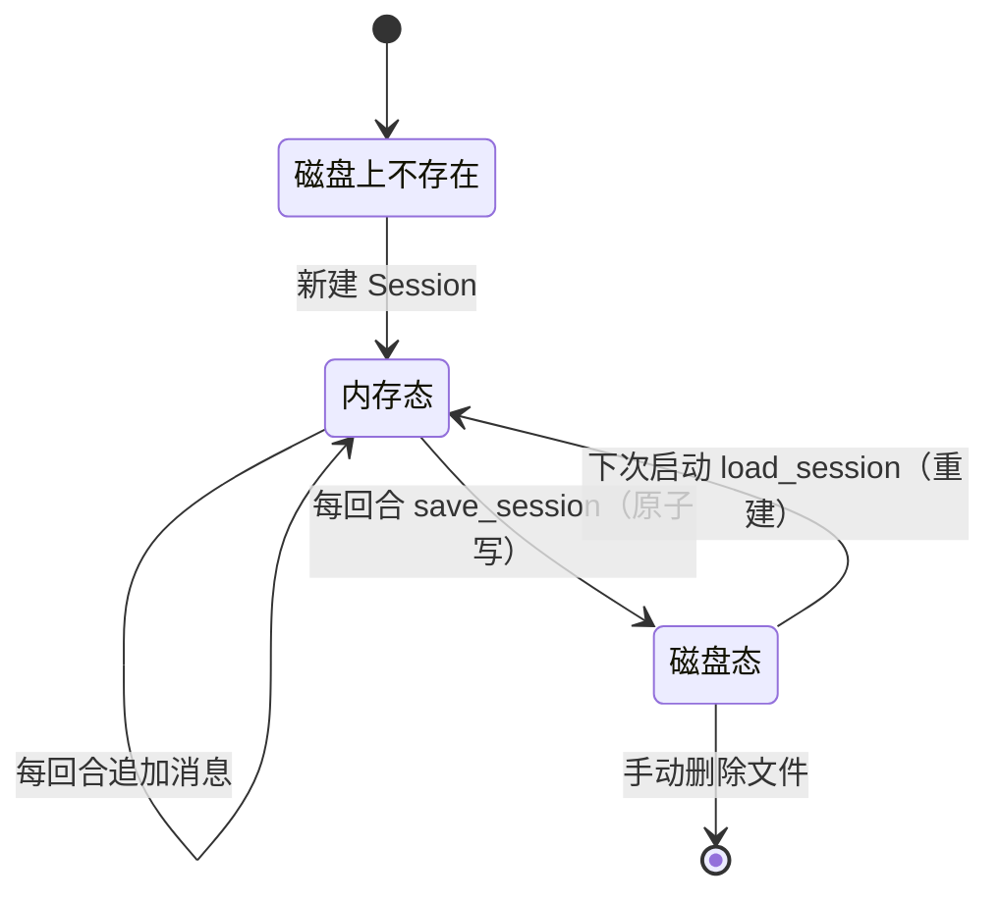
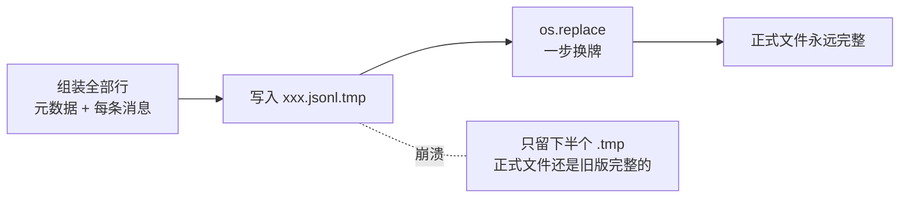
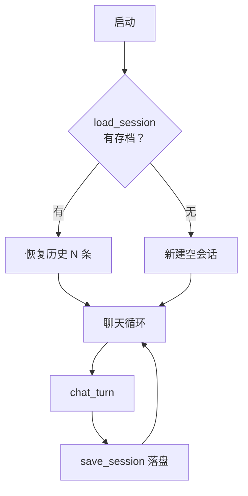

# 第 05 课：重启不失忆——会话持久化（JSONL）

## 1. 前言

你已经和这位助手聊了三天：它记得你问过的每个问题、算过的每笔账。但只要 `exit` 一退出、再启动——它盯着你，像第一次见面。因为这只"不断变厚的信封"住在**内存**里，进程一死，内存归还系统，历史蒸发。

这一课的心愿：

> 聊了一下午的内容，退出程序再进来，还在。

顺带一个更实际的要求：**聊到一半程序崩了，也不能丢掉已聊完的部分**。这决定了我们的保存时机（每回合存一次，而不是退出时才存）和写入方式（原子写——写到一半断电，文件也不能坏）。

从数据视角看，本课是整个项目第一次给数据"安家"：内存是旅馆，磁盘才是房产。从此会话有了**双份生命**：运行时在内存里流动，静止时在文件里沉睡。

## 2. 主要内容

### 2.1 这节课做什么（文字版步骤）

1. 新建 `nanobot_st/storage.py`：`save_session`（原子写入 JSONL：首行元数据 + 每行一条消息）与 `load_session`（按名恢复；文件不存在返回 None；损坏行跳过）；
2. 给 `Session` 补两个身份字段：`name`（会话名，也是文件名）和 `created_at`（诞生时刻，进元数据行）；
3. `main` 接上两处：启动时 `load_session("default") or Session("default")` 恢复；每个回合结束后 `save_session(session)` 落盘；
4. 数据目录约定：项目根下的 `data/sessions/<名字>.jsonl`（`.gitignore` 已忽略 data/）；
5. 测试：存→取往返一致；未存返回 None；损坏行跳过。测试用 `monkeypatch.setattr` 把存储目录重定向到 pytest 临时目录——绝不碰真实数据。

### 2.2 代码阅读链条（按这个顺序读）

**链条一：一个回合的落盘（主链新增环节）**

```text
chat_turn 正常返回回答
→ main 里 save_session(session)
→ storage.save_session：
     mkdir 确保目录存在
     lines = [元数据行] + [每条消息 json.dumps 一行]
     先写 <名字>.jsonl.tmp 临时文件
     os.replace(tmp, 正式文件)   ← 原子换牌
```

**链条二：程序启动时的恢复（主链新增环节）**

```text
python -m nanobot_st.chat
→ main: session = load_session("default") or Session("default")
→ storage.load_session：
     文件不存在 → None → or 右边生效，新会话诞生
     文件存在 → 逐行 json.loads：元数据行取 created_at，消息行 append 进 messages
     某行损坏 → JSONDecodeError → continue 跳过
→ 若有历史，打印"已恢复上次对话（N 条历史）"
```

**链条三：测试链（含目录重定向）**

```text
pytest → monkeypatch.setattr(storage, "SESSIONS_DIR", tmp_path)
→ 存一个三条消息的会话 → load 回来 → 逐字段断言相等
→ 手写一个含坏行的文件 → load → 好行幸存
```

### 2.3 流程总结（和上一课比多了什么）

主链的形状依旧，加的是**两个环节**：回合末尾的"落盘环节"与启动时的"恢复环节"——一进一出，正好把"内存会话"升级成"内存 + 磁盘双份会话"。另外 `Session` 对象本身长出了身份（name/created_at），它不再是一袋无名的消息。没有新链条、没有新分支，是典型的数据侧局部功能。

### 2.4 拔高一下

这是项目第一次接触**持久化**（persistence）这个大主题，我们选了最朴素也最透明的方案：**纯文本 JSONL**——人类肉眼可读、一行一记录、坏一行不伤全局。它不是玩具选择：原项目 nanobot 的会话存储就是 JSONL（外加 LRU 缓存、崩溃 checkpoint、跨进程文件锁三件工程装甲）。对比一下"上来就 SQLite"的方案：数据库当然强大，但会话的核心访问模式是"整读整写一条流"，文件已经够用——**用最简单的工具满足当前需求**，需求变了再换，这正是本课程反复出现的决策方式。

## 3. 技术要点

### 3.0 环境配置是基础

零新依赖（`json`、`os`、`pathlib` 全是标准库）。数据文件在 `data/sessions/` 下，`cat data/sessions/default.jsonl` 可直接用肉眼检查。测试照旧 `uv run pytest -v`。

### 3.1 坐标是指南针

```text
nanobot_st/
├── storage.py     ★ 新增：磁盘的家（存/取/坏行容忍）——纯文件操作，不认识模型
├── session.py     ★ 小改：长出身份（name / created_at）
└── chat.py        ★ 小改：main 接恢复与落盘两个环节
data/sessions/     ★ 新目录：运行期数据，git 永远不收（.gitignore）
```

模块分工更新：`session.py` 定义"会话是什么"，`storage.py` 负责"会话住哪"——**数据定义与存储机制分离**，将来若换 SQLite，只动 storage 一处。

### 3.2 代码是中心

#### 文件一：`nanobot_st/storage.py`（全文 59 行，本课主角）

```python
"""会话持久化：把内存里的会话保存为 JSONL 文件，重启后恢复。"""

import json
import os
from pathlib import Path

from nanobot_st.session import Session

# 数据目录：项目根目录下的 data/（.gitignore 已忽略，永远不进 git）
DATA_DIR = Path(__file__).resolve().parent.parent / "data"
SESSIONS_DIR = DATA_DIR / "sessions"


def session_path(name: str) -> Path:
    """会话名 → 对应的 JSONL 文件路径。"""
    return SESSIONS_DIR / f"{name}.jsonl"


def save_session(session: Session) -> None:
    """把整个会话原子写入文件：首行元数据 + 每行一条消息。

    "原子"指：先写进临时文件，全部写完后再用 os.replace 一步换成正式文件——
    中途断电/崩溃最多留下半个临时文件，正式文件永远是完整的一份。
    """
    SESSIONS_DIR.mkdir(parents=True, exist_ok=True)
    lines = [
        json.dumps(
            {
                "_type": "metadata",
                "name": session.name,
                "created_at": session.created_at,
                "message_count": len(session.messages),
            },
            ensure_ascii=False,
        ),
        *[json.dumps(m, ensure_ascii=False) for m in session.messages],
    ]
    target = session_path(session.name)
    tmp = target.with_suffix(".jsonl.tmp")
    tmp.write_text("\n".join(lines) + "\n", encoding="utf-8")
    os.replace(tmp, target)


def load_session(name: str) -> Session | None:
    """按名字从磁盘恢复会话；文件不存在返回 None；损坏行跳过不崩溃。"""
    path = session_path(name)
    if not path.exists():
        return None
    session = Session(name=name)
    with path.open(encoding="utf-8") as f:
        for line in f:
            line = line.strip()
            if not line:
                continue
            try:
                record = json.loads(line)
            except json.JSONDecodeError:
                continue  # 跳过损坏行：丢一条消息，好过整个会话打不开
            if record.get("_type") == "metadata":
                session.created_at = record["created_at"]
                continue
            session.messages.append(record)
    return session
```

#### 文件二：`session.py` 的身份字段（与 `main` 的两个新环节）

```python
    def __init__(self, name: str = "default"):
        self.name = name
        self.created_at = datetime.now().isoformat()
        self.messages: list[dict] = []
```

```python
    # main 启动时：能恢复就恢复，不能就新建（or 短路的又一次应用）
    session = load_session("default") or Session("default")
    # main 每个回合后：
    save_session(session)
```

#### 怎么读懂它（层次视角）

- `storage.py` 负责**搬家**。`save_session` 输入一个内存 Session、输出一个磁盘文件（无返回值）；`load_session` 反向，输入名字、输出 Session 或 None。两者都**不修改会话内容**，只做内存态与文本态的互相翻译；
- `Session` 继续**只管数据本身**，它不知道自己会被存到哪里；
- `main` 是**调度员**：开场取房卡（load），每回合锁一次门（save）。

#### 设计故事（为什么这么写）

- 为了"崩溃也不丢已聊内容"，保存必须**每回合做一次**而不是退出时做（退出命令可能根本没机会执行）；
- 但每回合全量写文件，写到一半崩了怎么办？所以写法必须是**原子的**：先写临时文件、再一步改名。`os.replace` 在操作系统层面保证"改名"这个动作不可分割——要么看到旧文件，要么看到完整新文件，永远没有"半个"；
- 为什么一行一条消息（JSONL）而不是一个大 JSON 数组？三个理由：坏一行只丢一行（大 JSON 坏一个引号全盘皆输）；将来可以直接 `tail` 看最新消息、可以逐行追加（原项目正是逐行追加 + 全量重写混合）；肉眼看文件舒服；
- 为什么首行放元数据？会话级的"户口信息"（名字、诞生时间、条数）不属于任何一条消息，单独一行登记；将来要加会话级信息（比如原项目的归档水位线 `last_archived`、标题）都往这行放；
- 为什么坏行"跳过"而不是报错？持久化代码的第一美德是**宽容**：磁盘上的数据可能被各种方式弄脏，读取方唯一目标是"尽量多救回来"。
- 拟人化记忆：`save_session` 是**打包搬家公司**——把客厅（messages）里每件家具贴标签装箱（json.dumps）、列一张清单（元数据行）放最上面，整箱搬进仓库前先在门口拼完（临时文件），拼好了才正式入库（os.replace）。`load_session` 是**开箱还原师**，遇到摔坏的箱子（损坏行）就跳过那一件，绝不因此拒绝开工。

#### 文件三：`tests/test_storage.py`

三个测试的关键手法：`monkeypatch.setattr(storage, "SESSIONS_DIR", tmp_path)` 把模块里的目录常量**临时换成 pytest 提供的一次性目录**——测试无论怎么写都不会碰你真实的聊天记录。这是原项目 conftest 里大量使用的隔离手法（它把整个 sessions 目录都重定向了）。

### 3.3 数据是着眼点

**一个真实会话文件的长相**（`data/sessions/default.jsonl`，肉眼可读）：

```text
{"_type": "metadata", "name": "default", "created_at": "2026-09-26T10:20:01", "message_count": 4}
{"role": "user", "content": "现在几点了？"}
{"role": "assistant", "content": "", "tool_calls": [{"id": "call_1", "type": "function", "function": {"name": "get_time", "arguments": "{}"}}]}
{"role": "tool", "tool_call_id": "call_1", "name": "get_time", "content": "2026-09-26 10:20:03"}
{"role": "assistant", "content": "现在是 10:20。"}
```

**数据的三态变形**（本课新增第三态）：

```text
内存态：Session 对象（messages 里是活 dict）
  --save_session: json.dumps 每条-->  磁盘态：JSONL 文本行（UTF-8）
  --load_session: json.loads 每行-->  内存态（新 Session 对象）
```

要点：**内存态和磁盘态内容等价，但身份不同**——load 出来的是"新房子里的旧家具"，和原来的对象不再是同一个 `is`，只是 `==`。所以"恢复"的本质是**重建**而不是复活。

另一个值得注意的细节：`ensure_ascii=False` 让中文直接以汉字写入文件（默认 True 会写成 `\u4f60\u597d` 这种转义）——肉眼可读性翻倍，文件还更小。

### 3.4 状态是重要视角

会话的生命周期从"进程级"升级为"跨进程级"：



谁改状态：`chat_turn` 改内存态；`save_session` 产出磁盘态；`load_session` 消费磁盘态。**磁盘态是唯一的"真相之源"**：内存态崩了可以靠它恢复，反之不然——所以保存方向（内存→磁盘）永远不能丢，恢复方向偶尔失败无所谓（大不了重聊）。

### 3.5 流程图是重要工具

保存的原子写两步舞：



启动恢复与回合落盘在主链上的位置：



### 3.6 细节技术点

- **pathlib 的 Path**：`Path` 对象用 `/` 拼路径（`SESSIONS_DIR / f"{name}.jsonl"`），跨平台自动处理分隔符；`mkdir(parents=True, exist_ok=True)` 一句话完成"目录不存在就建、存在也不报错"；`with_suffix(".jsonl.tmp")` 把 `a.jsonl` 变成 `a.jsonl.tmp`——注意它替换的是最后一个后缀；
- **`Path(__file__)` 定位数据目录**：`__file__` 是本代码文件自身的路径，`resolve().parent.parent` 即项目根目录——这样无论从哪个工作目录启动程序，data/ 都在同一个地方（比依赖"当前目录"的写法稳得多）；
- **`json.dumps` 的 `ensure_ascii=False`**：见 3.3。顺带：dumps 还有一个常用参数 `indent=2`（美化缩进），但 JSONL 一行一条，不能缩进；
- **`os.replace` vs `os.rename` vs `Path.rename`**：replace 在目标已存在时**直接覆盖**且跨平台行为一致（Windows 上 rename 遇到已存在目标会报错）——原子写的标准搭配就是"临时文件 + replace"；
- **`with path.open(encoding="utf-8") as f`**：文件打开的上下文管理器，with 块结束自动关闭。逐行 for 循环不把整个文件读进内存（虽然我们 save 是全量写，读按行读是个好习惯）；
- **`monkeypatch.setattr(模块, "名字", 新值)`**：pytest 提供的"测试期间偷换模块常量/函数"，测试结束自动还原。上节课 setenv 换环境变量，这次 setattr 换模块变量——同一思想的两种应用：**测试要在隔离的环境里做**；
- **tmp_path 夹具**：pytest 给每个测试函数一个独一无二的临时目录（`/tmp/pytest-xxx/test_xxx0/`），测完自动清理——存取类测试的标准搭档；
- **"先写临时再替换"为何是原子的**：写文件的过程可能被打断（断电、磁盘满、进程被杀），而"改名"在操作系统内部是一个不可分割的小操作。把"漫长的危险动作"放在旁人看不见的临时文件上做，把"瞬间的安全动作"留给正式文件——这是数据库 WAL、编辑器保存、下载器等一切"不能写坏旧文件"场景的通用套路。

### 3.7 对照原项目：我们没做的三件装甲

原项目 `session/manager.py`（约 1500 行）在同样的 JSONL 方案上加了三层工程装甲，我们刻意不做，原因如下：

| 原项目有 | 解决什么 | 我们为什么不做 |
|---|---|---|
| LRU 内存缓存（上限 128）+ 关机 flush | 多会话常驻服务不能全装在内存 | 我们单会话、单进程 |
| `.checkpoint.json` 边写边存进行中回合 | 回合进行到一半崩溃，恢复"半成品" | 我们每回合落盘，最坏丢当前回合（可接受） |
| `filelock` 跨进程文件锁 | 两个进程同时写同一会话文件 | 我们保证只有一个进程在跑 |

等哪一条的痛点真实出现（比如第 15 课服务化后可能多请求并发），再回来加对应装甲——记录在此，不忘即可。

## 4. 测试与验收

### 测试一：存取往返一致（tests/test_storage.py）

- **测什么**：save 后 load，对象内容逐一相等；
- **为什么测**：持久化的最低契约——**存什么取什么**，任何一次序列化偏差（丢字段、转义错、顺序乱）都会让"记忆"失真；
- **输入**：含 3 条消息（user/assistant/tool 各式）的会话；
- **预期**：name、created_at、messages 全部相等；
- **证明了什么**：内存态 ⇄ 磁盘态的翻译无损。

### 测试二：未存盘返回 None

- **预期**：`load_session("never_saved") is None`；
- **证明了什么**：main 里 `load or Session` 的短路分支成立，新用户能正常开始。

### 测试三：损坏行跳过

- **输入**：手写一个第 3 行是非法 JSON 的文件；
- **预期**：第 1、2 条消息幸存；
- **证明了什么**：读取方的宽容性——磁盘脏数据不致命。

### 本课验收清单

- [ ] `uv run pytest -v` 十二条测试全绿；
- [ ] 真实验证：聊两句 → exit → 重新启动 → 打印"已恢复（N 条历史）"→ 追问上一轮内容能接住；
- [ ] `cat data/sessions/default.jsonl` 亲眼看到中文可读的消息行；
- [ ] 能说出"为什么每回合存而不是退出时存"、"为什么先写临时文件再替换"；
- [ ] 完成 git commit。

## 5. 总结

这一课之后，助手拥有了跨重启的记忆：`storage.py` 给数据安了磁盘的家，`main` 在回合边界落盘、在启动时恢复，原子写保证任何时刻断电文件都是完整的。`Session` 也从"一袋消息"长成"有名字、有生日的持久对象"。

老规矩，看看埋下了什么：

1. **历史只会越来越长**：现在每回合全量重发全部历史，聊三百回合后既贵又可能超过模型上限——第 6 课（下一课）处理"带多少历史出门"；
2. **只有一个 default 会话**：想开"工作"、"生活"两条线？得改代码。第 9 课做多会话管理；
3. **人设还没安家**：你每次都要先交代"用中文、简洁点"——它也留在第 6 课解决。

对照原项目的三件装甲（LRU/checkpoint/filelock）我们记了账，等真正的需求（多进程、长回合）出现再回来穿。

---
*配套文件：`nanobot_st/storage.py`（新增）、`nanobot_st/session.py`（身份字段）、`nanobot_st/chat.py`（恢复与落盘环节）、`tests/test_storage.py`（新增）、`tests/test_session.py`（小改）*
