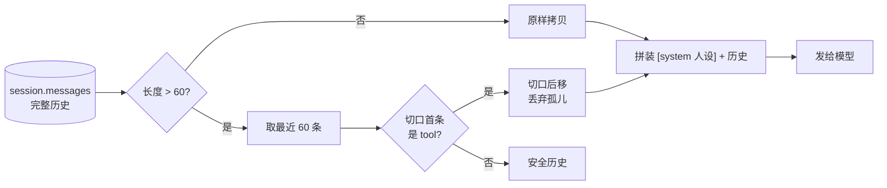
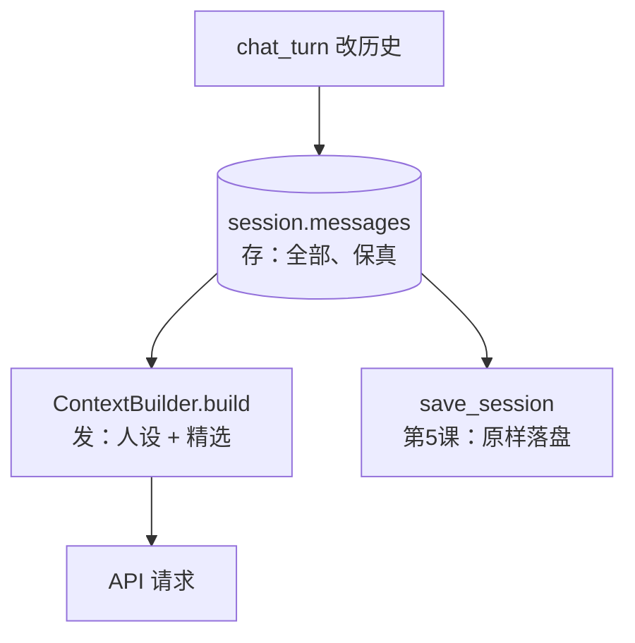

# 第 06 课：助手的人格——系统提示词与上下文管理

## 1. 前言

两个烦恼，一次解决。

**烦恼一：人设天天丢。** 每次开聊你都要先交代一遍："请用中文、回答简洁点、算数别心算。"忘了交代，它就放飞自我——英文、啰嗦、还自信地算错。你想要一个**稳定人格**：这些要求应该长在它身上，而不是每次都由你现场灌输。

**烦恼二：历史无限涨。** 上一课的会话现在能跨重启了，于是你放心大胆地聊——两百个回合之后问题来了：每次请求都把全部历史重发一遍（第 2 课的老规矩），又贵（按量计费）、又慢、而且**总有一天会超过模型的上下文窗口上限**，API 直接报错拒收。

这一课的心愿：

> 人设固定下来不用重交代；带出门的历史有个上限，且截断后不出乱子。

做法是引入消息家族的第四位成员——`system` 角色（前三位 user/assistant/tool 你都熟了），再把"发什么历史"的决策从 `chat_turn` 里抽出来，交给一位专职的**上下文组装师** `ContextBuilder`。这位组装师未来会很忙：长期记忆注入（第 13 课）、工具结果截断都是它的活，今天先让它上岗干最基础的两件事。

## 2. 主要内容

### 2.1 这节课做什么（文字版步骤）

1. 新建 `nanobot_st/context.py`：`SYSTEM_PROMPT`（固定人设文本）、`ContextBuilder` 类（build：人设 + 截断后历史）、`truncate_history` 函数（保留最近 N 条，铁律：不产生孤儿 tool 消息）；
2. `chat.py` 改一行核心：`messages=CONTEXT_BUILDER.build(session)`——发给模型的不再直接是 session.messages，而是组装师的成品；
3. 测试：组装结果首条恒为 system；超长历史被截断；切口落在 tool 结果上时自动后移；短历史原样返回。

### 2.2 代码阅读链条（按这个顺序读）

**链条一：一次请求的上下文诞生（主链被替换的环节）**

```text
chat_turn 循环内准备请求
→ CONTEXT_BUILDER.build(session)
     第一步 truncate_history(session.messages, 60)
          ≤60 条 → 原样拷贝返回
          >60 条 → 取最近 60 条；若切口首条是 role:"tool"（它的便签被切掉了）
                   → 切口后移，直到安全
     第二步 返回 [system 人设] + 截断历史
→ client.chat.completions.create(messages=组装结果, tools=菜单)
```

**链条二：截断铁律（本课最精巧的环节）**

```text
历史[..., 便签c1, 结果c1, 用户问]  keep_last=1
→ 朴素切口取到最后 1 条 = [结果c1]  ← 便签没了，这是孤儿 tool，非法！
→ while 首条是 tool：切口后移 → []（这一条也丢了）
→ 宁可少带一条，不带一条非法的
```

### 2.3 流程总结（和上一课比多了什么）

主链的"请求环节"前面加了一个**预处理环节**：过去 `messages` 直接取自 session.messages，现在要经过组装师（置顶人设 + 裁剪历史）再出门。这是典型的**环节级**变化——链条本身（请求 → 方向盘 → 工具 → 回填）一步没动。另一个隐藏变化：发给模型的消息序列从此**不再等于**存储的历史（多了 system、可能少了旧消息），"存的"和"发的"正式分家。

### 2.4 拔高一下

"人设"这件事在业界的名字叫 **system prompt**（系统提示词），它是四种消息角色中最特殊的一位：不参与对话轮替、永远排第一、模型对它的服从度最高。整个 AI 产品行业有一门手艺叫"提示词工程"，一半的功力都花在这条消息上——原项目 nanobot 的 system prompt 由身份模板 + 工具契约 + 长期记忆 + 技能摘要层层拼装（`ContextBuilder`），今天我们写下它的第一层。

截断策略上，我们用的是最简单的"保留最近 N 条"；业界更成熟的做法是**摘要压缩**——把被丢弃的旧历史先用模型总结成一段摘要，作为一条"回忆"消息带上（原项目的 `Consolidator` + 水位线 `last_archived` 就是全套实现）。概念今天讲清楚（见 3.6 末尾），实现留给扩展课——当"丢掉的记忆里有重要信息"成为真实痛点时再来。

## 3. 技术要点

### 3.0 环境配置是基础

零新依赖。测试照旧 `uv run pytest -v`。

### 3.1 坐标是指南针

```text
nanobot_st/
├── context.py     ★ 新增：出发前的打包台（人设 + 历史裁剪）——只读 session，不写 session
├── chat.py        ★ 一行核心改动：messages 从"裸历史"换成"组装成品"
└── session.py     （未动——它照旧存完整历史，裁剪只发生在"出门"那一刻）
```

注意一个重要的分工原则：**session 存的是全部，context 发的是精选**。存储不裁剪（保真），发送才裁剪（省 token）——两者职责分开，谁也不越界。

### 3.2 代码是中心

#### 文件一：`nanobot_st/context.py`（全文 41 行，本课主角）

```python
"""上下文组装：固定人设（system prompt）+ 历史截断。"""

from nanobot_st.session import Session

# 固定人设：每次请求都作为第一条消息（system）发给模型
SYSTEM_PROMPT = """你是 shitan 的个人 AI 助手。
- 始终用简体中文回答，风格简洁、严谨
- 不确定的事要明说，不要编造
- 涉及数字计算时使用 calculator 工具，不要心算"""

# 历史最多带多少条消息（超出的从最老的开始丢弃）
MAX_HISTORY_MESSAGES = 60


class ContextBuilder:
    """把"人设 + 会话历史"组装成每次真正发给模型的消息列表。"""

    def __init__(self, system_prompt: str = SYSTEM_PROMPT, max_history: int = MAX_HISTORY_MESSAGES):
        self.system_prompt = system_prompt
        self.max_history = max_history

    def build(self, session: Session) -> list[dict]:
        """产出 [system 人设] + [截断后的历史]；session 的原始历史不被修改。"""
        history = truncate_history(session.messages, self.max_history)
        return [{"role": "system", "content": self.system_prompt}, *history]


def truncate_history(messages: list[dict], keep_last: int) -> list[dict]:
    """只保留最近 keep_last 条历史，返回新列表（不动原列表）。

    铁律：不能把 assistant 便签截掉、却留下它的 tool 结果——
    "孤儿 tool 消息"是非法历史，API 会直接拒收。
    所以若切口正好落在 tool 结果上，就再多丢几条，直到切口安全。
    """
    if len(messages) <= keep_last:
        return list(messages)
    cut = messages[-keep_last:]
    safe_start = 0
    while safe_start < len(cut) and cut[safe_start].get("role") == "tool":
        safe_start += 1
    return cut[safe_start:]
```

#### 文件二：`chat.py` 的改动（一处 import、一个全局、一行使用）

```python
from nanobot_st.context import ContextBuilder
CONTEXT_BUILDER = ContextBuilder()          # 与 REGISTRY 同款的全局单例

# 旧：messages=session.messages
messages=CONTEXT_BUILDER.build(session),
```

#### 怎么读懂它（层次视角）

- `context.py` 的 `ContextBuilder` 负责**打包出发**。它的 `build` 输入一个 Session（只读！）、输出一份消息列表；它把"裁多少历史"这件事**委托**给了同文件的 `truncate_history`；
- `truncate_history` 是个纯函数：输入消息列表和保留数，输出新列表——不碰原件、不看外部状态，这种函数最好测也最可靠；
- `chat.py` 的 `chat_turn` 只多认一个同事：要 messages 就找 `CONTEXT_BUILDER`。**引擎从此不再关心"历史怎么挑"**。

#### 设计故事（为什么这么写）

- 为了人设稳定，需要每次请求都带一条最高优先级的指令，所以有了 system 消息——它必须每次现拼进列表，而不是存进 session（人设是"程序配置"不是"对话历史"，存进历史反而会被截断丢掉）；
- 为了控制长度，需要裁剪，但裁在哪里有讲究：朴素地从"第 len-60 条"切，可能正好把便签切掉、结果留下——孤儿 tool 会让整个请求被 API 拒收。所以裁剪必须**感知配对**：切口落在 tool 上就后移。宁可少带一条，不带一条非法的；
- 为了不污染存储，裁剪必须在"出门前"做、且返回拷贝——session 里永远躺着完整历史（第 5 课的存盘也因此不用改一个字）；
- 拟人化记忆：`ContextBuilder` 是**出发前的打包师**——你把整个衣柜（session）指给它，它按出行规则装箱：最上面永远放一份《行为守则》（system 人设），衣服只带最近穿过的 60 件（截断），且**绝不把一只袖子留在箱外**（便签与结果不拆散）。衣柜本身一件衣服都不少。

#### 文件三：`tests/test_context.py`

四个测试，其中最值得读的是 `test_truncate_never_orphans_tool_results`（[tests/test_context.py:46](/home/shitanli/ln_rebuild_zcode/nanobot/nanobot-st/tests/test_context.py#L46)）：精心构造"切口正好落在 tool 结果上"的局面，验证铁律生效。

### 3.3 数据是着眼点

**组装前后对比**（本课最重要的数据变化）：

```text
session.messages（存储的，完整）：
  [user 问1, assistant 答1, user 问2, assistant 便签, tool 结果, assistant 答2, ... 共 200 条]

发给模型的 messages（第 7 次请求，组装后）：
  [0] system    "你是 shitan 的个人 AI 助手……"     ← 每次都在，永远第一
  [1..60]       最近 60 条历史（配对完整）           ← 最早的 140 条被留在家里
```

**四种角色全家福**（至此集齐，值得背下来）：

| role | 谁写 | 给谁看 | 特殊字段 |
|---|---|---|---|
| system | 程序（人设） | 模型 | 无；永远第一、不参与轮替 |
| user | 用户（或程序注入） | 模型 | content |
| assistant | 模型（经我们转录） | 下轮的模型 | content **或** tool_calls（便签形态） |
| tool | 程序（工具执行后） | 模型 | tool_call_id + name + content，必须紧跟对应便签 |

**一个容易混淆的点**：`build` 的返回列表里，history 部分的 dict 和 session 里是**同一批对象**（浅拷贝列表、共享元素）——但因为我们从不原地修改消息 dict（只 append 新的），这种共享是安全的。而 `truncate_history` 返回 `list(messages)` 新列表，保证调用方对返回值做切片/插入不会误伤 session。

### 3.4 状态是重要视角

本课没有新的对象生命周期，但有一条**新的恒定状态**：每个发出去的请求，其消息序列的第一条永远是 system——从第 1 次到最后一次请求，分毫不差。这在测试里是断言（`first_messages[0]["role"] == "system"`），在架构里是**不变量**（invariant）：无论历史怎么裁、将来注入什么（记忆、技能），打包师保证"守则永远置顶"。

截断本身引入了一个值得记住的视角：会话历史从此有了**"活跃窗口"**的概念——最近 60 条是热的（每次出门），更早的是冷的（躺在文件里）。原项目把这套玩到极致：冷热边界是个精确的**水位线数字**（`last_archived`），过线的历史被摘要成"回忆"顶替，摘要还能分批多次——窗口始终装得下，回忆还都在。

### 3.5 流程图是重要工具

组装流水线（请求前的预处理环节）：



存储与发送的分家（本课的架构变化一句话）：



### 3.6 细节技术点

- **system 角色的语义**：可以理解为"导演的开机须知"。user/assistant/tool 是对话的正片，system 是开拍前发给所有演员的守则——模型训练时被特别调教过"优先服从第一条 system"。所以人设、安全规则、输出格式要求都放这里；
- **token 与上下文窗口（本课最重要的一次概念课）**：模型计费和限长都不按"字"而按 **token**（词元）——模型眼中的最小语义碎片。经验值：英文约 4 字符/token；**中文大约 1 个汉字 ≈ 0.6~1 个 token**（不同模型分词器不同）。所谓"上下文窗口 128K"就是 system + 历史 + 工具菜单 + 本轮生成的总 token 上限。我们用"条数"控制是粗粒度近似（每条消息长度差异大）；原项目用真 token 预算：`输入预算 = 窗口 - 预留输出 - 安全余量`，超了就压缩（`ContextGovernor`）。教学版 60 条够用，概念必须到位；
- **列表切片 `[-keep_last:]`**：负数下标从尾部数起，`messages[-10:]` 即"最后 10 条"——比 `messages[len-10:]` 优雅；
- **`while` 当"扫描器"用**：截断铁律里那个 `while ... cut[safe_start].get("role") == "tool"` 是"从左往右扫过连续的 tool 消息"——while 不只用于循环干活，也常用于**游标推进**；
- **`get("role")` vs `["role"]`**：dict 取值的两种方式——`[]` 键不存在直接 KeyError，`get` 返回 None。读"可能有缺字段的外来数据"用 get 更稳（这里的消息都是自家造的，用 get 是防御习惯）；
- **返回拷贝而不是原件**（`list(messages)`）：函数返回可变对象前先拷贝，调用方怎么改都不伤原数据——`is not` 断言验证的就是"两个列表不是同一个对象"；
- **解包拼列表 `[x, *history]`**：星号把列表"摊开"铺进新列表，`[system, *历史]` 一行完成置顶拼接；
- **摘要压缩（业界做法，概念储备）**：截断是"忘记"，压缩是"记笔记"——把要丢的旧历史先发给模型说"请总结成 200 字"，摘要作为一条特殊 user 消息顶在窗口最前（原项目的 checkpoint 消息 + `SUMMARY_CONTINUATION_TEXT`）。效果：细节丢了、梗概还在。代价：多一次 API 调用。什么时候值得？当"完全忘记"开始造成实际损失时——这就是我们把它留到扩展课的理由。

## 4. 测试与验收

### 测试一：组装结果首条恒为 system（tests/test_context.py）

- **测什么**：`build` 产出的消息序列结构与顺序；
- **预期**：`[0]` 是 system 且包含人设关键词；`[1:]` 与历史一致；session 未被修改；
- **证明了什么**：人设稳定生效的最底层保证——无论历史如何，守则永远置顶。

### 测试二：超长截断保留最近 N 条

- **输入**：100 条；**预期**：恰好最后 10 条；
- **证明了什么**：窗口控制的基本功能。

### 测试三：截断铁律（本课灵魂测试）

- **输入**：`[user 早, 便签c1, 结果c1, user 晚]`，keep_last=1（朴素切口正好落在"结果c1"上）；
- **预期**：只幸存"晚"（孤儿 tool 被额外丢弃）；原列表 4 条未动；
- **证明了什么**：截断永远产出**合法**历史——这条不变量 API 不会提前告诉你错了，只有真实请求被拒收时才炸，测试提前拦住。

### 测试四：短历史原样返回

- **预期**：内容相等且**不是同一个列表对象**（`is not`）；
- **证明了什么**：函数无副作用，返回值可放心使用。

### 回归：test_chat.py 的全部断言已更新

所有对"发出的消息"的断言现在都包含 system 首条（序列整体后移一位）——16 条测试全绿确认无回归。

### 本课验收清单

- [ ] `uv run pytest -v` 十六条测试全绿；
- [ ] 真实验证：开聊**不交代任何要求**，直接问一个英文问题——它应该仍用中文答（人设生效）；算个数——它应该调 calculator（守则生效）；
- [ ] 能背出四种角色和各自的关键字段；
- [ ] 能说出"截断为什么必须保配对"以及"宁可少带、不带非法"；
- [ ] 完成 git commit。

## 5. 总结

这一课，助手有了**稳定人格**和**出门的行李上限**：`ContextBuilder` 每次请求前打包"守则置顶 + 最近 60 条安全历史"，存储侧纹丝未动（存的是全部，发的是精选）。四种消息角色至此集齐，"发的 ≠ 存的"这个分离会支撑后面很多演化——长期记忆注入、工具结果瘦身，都发生在打包台上。

遗留的问题按紧急度排：

1. **长回答干等 20 秒**：回复是整段生成的，你盯着空屏幕。——第 7 课（下一课）解决：流式输出，边生成边显示；
2. **网络抖一下就崩**：一次 429/超时，整个回合失败。——第 8 课：重试与容错；
3. **摘要压缩**还只是概念——当冷历史里真的开始丢重要信息时，回来把它做成真功能。

下一课很轻，但体验提升最直观：你会第一次看到自己的助手"一边想一边说"。

---
*配套文件：`nanobot_st/context.py`（新增）、`nanobot_st/chat.py`（一处核心改动）、`tests/test_context.py`（新增）、`tests/test_chat.py`（断言更新）*
