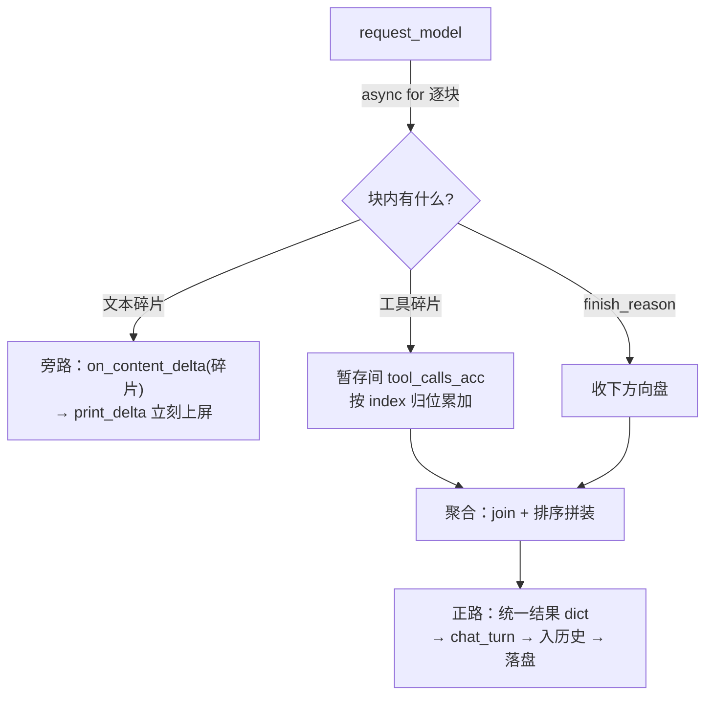
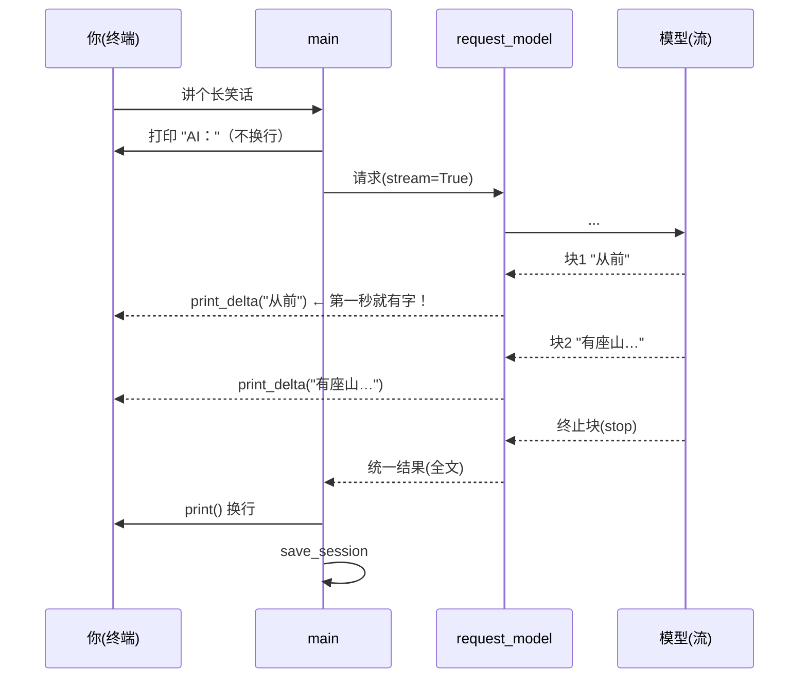

# 第 07 课：别让我干等——流式输出

## 1. 前言

现在的助手能力齐整：有记忆、有工具、有人设。但每次提问，你都要**盯着空屏幕等 15~30 秒**，然后"啪"一整段答案砸出来。答案越长，等得越久——而你明明知道，模型那边是一个字一个字生成的，就像对面打字的人在写一封长信，写完才肯寄。

这一课的心愿：

> 让我看到它"正在打字"——边生成，边显示。

技术上这叫**流式输出**（streaming）：请求加一个 `stream=True`，响应就从"一整包"变成"一连串小块"（chunk，业界俗称挤牙膏）。小块们顺着网络陆续到达，我们每到一个就**立刻交给一个回调**去显示，最后再把碎片**聚合**成完整文本入库。

这次改造还带来一个意外收获：为了处理流式块，我们把"发请求、拆响应"从 `chat_turn` 里抽出来，交给一位专职的 `request_model`——它把 SDK 的流式块翻译成统一结果，`chat_turn` 反而变简单了。原项目里这个角色由 provider 层的 `_parse_chunks` 担任，结构如出一辙。

## 2. 主要内容

### 2.1 这节课做什么（文字版步骤）

1. `chat.py` 新增 `request_model`：发起流式请求 → `async for` 逐块消费 → 文本碎片随手经回调 `on_content_delta(片段)` 交出 → 工具调用碎片按 index 聚合 → 返回统一结果 dict（finish_reason / content / tool_calls）；
2. `chat_turn` 改用 `request_model`：从此只面对"统一结果"，不再直接碰 SDK 响应对象；`on_content_delta` 作为参数透传下去；
3. `main` 接上打字机：`print("AI：", end="")` 起个头，回调 `print_delta` 逐段打印，回合结束补换行；
4. 假客户端升级成"假流"：create 返回一个支持 `async for` 的 `_FakeStream`，剧本文本按 2 字一块拆、工具参数从中间劈成两半——专门考验聚合能力；
5. 测试：碎片按序到达回调；聚合后等于完整回答；劈两半的工具参数能拼回并正确执行。

### 2.2 代码阅读链条（按这个顺序读）

**链条一：一次流式请求的完整旅程（本课主链）**

```text
chat_turn 循环内 → request_model(client, 组装好的 messages, on_content_delta)
  → create(..., stream=True) 返回一个"流"对象
  → async for chunk in stream:            ← 每到一块处理一块
       chunk.choices[0].delta.content 有货？
         → content_parts.append + 立刻 on_content_delta(片段)   ← 打字机在此刻发生
       chunk.choices[0].delta.tool_calls 有货？
         → 按 tc.index 找到暂存间格子，id/name 记下、arguments 累加
       chunk.choices[0].finish_reason 有值？（最后一块）
         → 收下方向盘
  → 聚合：content = "".join(content_parts)；tool_calls 按 index 排序拼装成标准信封
  → 返回 {"finish_reason", "content", "tool_calls"}
```

**链条二：打字机在终端上的接法（main）**

```text
input 收到问题 → print("AI：", end="")           ← 只起头不换行
→ chat_turn(..., on_content_delta=print_delta)   ← 回调一路透传到 request_model
     每个碎片到达 → print_delta(片段) → print(片段, end="", flush=True)  ← 立刻上屏
→ 回合结束 → print() 补换行 → save_session
```

**链条三：测试的"挤牙膏"剧组**

```text
剧本 {"finish_reason": "stop", "content": "你好！很高兴见到你。"}
→ _build_chunks 拆成 6 块：["你好"]["！很"]["高兴"]["见到"]["你。"][终止块]
→ _FakeStream 支持 async for（__aiter__/__anext__）
→ 断言：回调按序收到 5 片；answer 等于拼接全文；入库的是全文不是碎片
```

### 2.3 流程总结（和上一课比多了什么）

上一课主链的"请求环节"内部是"一次 create、一次拿整包"。本课把这个环节**整体升级**：内部变成"流式消费 + 双通道输出"——一条通道是**旁路**（碎片经回调实时上屏，快但不入库），另一条是**正路**（碎片聚合成完整结果，走原有流程入库、进历史）。主链对外的一切行为（消息序列、工具循环、落盘）分毫未变。用链条/分支/环节的语言说：**给"请求"这个环节内部加了一条旁路**，主链拓扑不变。

### 2.4 拔高一下

"回调"（callback）这个手法值得专门认识：普通调用是"我打电话问你结果"，回调是"我把自己的号码留给你，有进展你打给我"——**控制权反转了**（术语叫控制反转 IoC 的雏形）。`request_model` 根本不知道碎片要拿去干什么：打印到终端？推给网页？存进日志？它不关心，它只管按约定喊一声。原项目把这套玩成了完整的**钩子系统**（AgentHook：on_stream/on_stream_end/生命周期钩子扇出），再往上接事件总线（StreamDeltaEvent）把增量广播给 WebUI/Telegram——骨架就是今天这根旁路。

另外，"碎片 → 聚合"的模式你会反复在工程里见到：直播弹幕、日志采集、大文件分片下载，全是它。**流式处理三件套：逐块消费、增量上交、终点聚合**，今天一次练齐。

## 3. 技术要点

### 3.0 环境配置是基础

零新依赖（流式能力 openai SDK 自带）。测试照旧 `uv run pytest -v`。

### 3.1 坐标是指南针

```text
nanobot_st/
└── chat.py        ★ 本课唯一改动的源码文件
    ├── request_model   ★ 新增：流式请求与聚合（引擎的"耳朵"）——原项目 provider 层的雏形
    ├── chat_turn       ★ 简化：只面对统一结果 dict，回调透传
    ├── print_delta     ★ 新增：打字机回调（终端专用）
    └── main            ★ 小改：起头 + 回调接线 + 收尾换行
tests/test_chat.py ★ 假客户端升级为"假流"（async for 可消费）
```

### 3.2 代码是中心

#### 文件一：`request_model`（[nanobot_st/chat.py:42](/home/shitanli/ln_rebuild_zcode/nanobot/nanobot-st/nanobot_st/chat.py#L42)，本课主角，全文见项目）

```python
async def request_model(client, messages, on_content_delta=None) -> dict:
    """发起一次流式请求，把各式各样的流式块聚合成统一结果。"""
    stream = await client.chat.completions.create(
        model=resolve_model(), messages=messages,
        tools=REGISTRY.schemas(), stream=True,
    )
    content_parts: list[str] = []
    tool_calls_acc: dict[int, dict] = {}   # 工具调用暂存间：index → 碎片累积
    finish_reason = None
    async for chunk in stream:
        if not chunk.choices:
            continue                       # 个别服务会发一个没有正文的空块
        choice = chunk.choices[0]
        delta = choice.delta
        piece = delta.content
        if piece:
            content_parts.append(piece)
            if on_content_delta:
                on_content_delta(piece)    # ← 打字机在此刻发生
        for tc in delta.tool_calls or []:
            slot = tool_calls_acc.setdefault(tc.index, {"id": "", "name": "", "arguments": ""})
            if tc.id:
                slot["id"] = tc.id
            if tc.function and tc.function.name:
                slot["name"] = tc.function.name
            if tc.function and tc.function.arguments:
                slot["arguments"] += tc.function.arguments
        if choice.finish_reason:
            finish_reason = choice.finish_reason
    tool_calls = [ ...按 index 排序，拼成标准 dict 信封... ]
    return {"finish_reason": finish_reason, "content": "".join(content_parts), "tool_calls": tool_calls}
```

#### 文件二：`chat_turn` 的简化（对比第 6 课版本）

```python
# 旧（第 3~6 课）：直接消费 SDK 响应对象
response = await client.chat.completions.create(...)
choice = response.choices[0]
tool_calls = [ {...for tc in choice.message.tool_calls...} ]   # 手工对象转信封

# 新（本课）：request_model 已把流式块聚合成统一结果，信封直接可用
result = await request_model(client, CONTEXT_BUILDER.build(session), on_content_delta=...)
if result["finish_reason"] == "tool_calls":
    session.add_assistant_tool_calls(result["tool_calls"])     # 直接用
    ...
```

#### 文件三：打字机接线（main 内）

```python
print("AI：", end="", flush=True)                     # 起头不换行
await chat_turn(client, session, question, on_content_delta=print_delta)
print()                                              # 收尾补换行
```

#### 怎么读懂它（层次视角）

- `request_model` 负责**一次模型请求的全过程**。输入：客户端 + 组装好的消息 + 可选回调；输出：统一结果 dict。它把"调 SDK、消费流、拼碎片"全部关在自己屋里，对外只说一种语言（三种字段的 dict）——`chat_turn` 和测试都因此变简单；
- `chat_turn` 继续**当心跳**，且比以前更纯粹：看 `result["finish_reason"]` 决定走工具分支还是收工，回调原样透传（自己不打印一个字）；
- `print_delta` 是**终端专属的插头**：只认"给我一段文字"，把它打到屏幕。换到网页上，就换一个往 WebSocket 推的插头——`request_model` 无感。

#### 设计故事（为什么这么写）

- 为了打字机效果，必须"每到一个碎片就交出去"，而不是攒齐再交——所以回调的调用点在 `async for` 循环**内部**，而不是循环之后；
- 为了入库和显示两不误，必须**双通道**：碎片实时走回调（快），聚合结果走正路（完整）。只走回调则历史里存不上完整回答；只聚合则没有打字机；
- 工具调用参数也是碎片来的（这是流式最阴的坑），所以需要暂存间 `tool_calls_acc`：以 index 为格子（一次要两只手就是两个格子），第一片带 id/name，后续片只有 arguments 补充——**按 index 归位、字符串累加**；
- 为什么把请求+聚合抽成 `request_model`？因为 `chat_turn` 里同时挤着"流式细节"和"循环编排"两种关心的事，抽走前者，后者一页能读完。这不是提前设计，是顺手整理。
- 拟人化记忆：`request_model` 是**同声传译员**——对面（模型）一句一顿地说话（chunk），它一边即时转述给你（回调），一边暗自记笔记（累加），对方说完，交出一份完整纪要（统一结果）。`print_delta` 是**字幕机**，只负责把听到的一小段立刻打上屏幕。

#### 文件四：假流（tests/test_chat.py）

`_FakeStream` 实现了 `__aiter__`/`__anext__`（异步迭代器协议），`_build_chunks` 把剧本拆成小块——文本 2 字一块、工具参数劈两半。看懂它，你就懂了 async for 的另一端长什么样。

### 3.3 数据是着眼点

**一个文本流的块序列**（"你好！很高兴见到你。"被拆成）：

```text
chunk1: delta.content="你好"        chunk2: delta.content="！很"
chunk3: delta.content="高兴"        chunk4: delta.content="见到"
chunk5: delta.content="你。"        chunk6: delta.content=None, finish_reason="stop"
```

**一个工具调用的碎片序列**（calculator，参数被劈成两半）：

```text
chunk1: delta.tool_calls=[{index:0, id:"call_1", name:"calculator",
                            arguments:'{"a": 12, '}]        ← 第一片：身份证齐全
chunk2: delta.tool_calls=[{index:0, arguments:'"b": 34, "operator": "*"}'}]  ← 后续片：只有参数补充
chunk3: finish_reason="tool_calls"
```

聚合后还原成你熟悉的信封（和第 3 课非流式版本逐字节一致）：

```json
{"id": "call_1", "type": "function",
 "function": {"name": "calculator", "arguments": "{\"a\": 12, \"b\": 34, \"operator\": \"*\"}"}}
```

**三对容易混淆的数据形态**（本课的概念核心）：

| | 增量（delta） | 全量（聚合后） |
|---|---|---|
| 文本 | 每块一小段 `content`，只表示"新增" | `"".join(parts)`，完整回答 |
| 工具参数 | 每片一小截 `arguments` 字符串片段 | 拼接后才可 `json.loads` 的完整参数 |
| 通道 | 走回调实时上屏（不入库） | 走正路入库、进历史（不重复上屏） |

还要分清 `delta.content` 与 `message.content`：前者是"这一块新到的一小段"（流式专属），后者是"完整消息的正文"（非流式时代的字段）。SDK 里 chunk.choices[0].delta 对应 response.choices[0].message——同一个位置，流式时叫 delta。

### 3.4 状态是重要视角

没有新的跨请求状态，但出现了一类新东西：**流内临时状态**——`content_parts`、`tool_calls_acc`、`finish_reason` 三个变量，诞生于请求开始、消亡于请求结束（`return` 后即无）。它们的生命周期不足一秒，却是聚合的关键：**把无序到达的碎片，按约定归位成有序的结果**。`tool_calls_acc` 的 index→格子结构尤其值得记住：多个工具并发流式时，各碎片靠 index 各回各家，互不干扰。

### 3.5 流程图是重要工具

双通道全景（本课的架构核心）：



打字机时序（用户体验视角）：



### 3.6 细节技术点

- **`async for` / 异步迭代器**：普通 for 从迭代器拿"现成数据"；async for 每一步可以**等**（等网络下一块到货）。自定义方法：实现 `__aiter__`（返回自己）和 `__anext__`（返回下一块 / 抛 `StopAsyncIteration` 结束）。真实 SDK 的流是它自己实现的；测试里我们手写了一个最小的——`_FakeStream` 全文 15 行，是理解该协议最好的教材；
- **回调即"留下电话号码"**：`on_content_delta=print_delta` 传的是**函数本身**（没有括号！加括号是"立刻调用"，不加是"把这个函数交出去"）。`on_content_delta=received.append` 更妙：列表的 append 方法直接当回调用，每片自动 `received.append(碎片)`——测试收集顺序零代码；
- **`print(..., end="", flush=True)`**：`end=""` 取消默认换行（打字机不能每段一行）；`flush=True` 强制立刻刷新输出缓冲区——没有它，Python 可能攒一批才显示，打字机变成"卡带机"；
- **`dict.setdefault(key, 默认)`**：键不存在则建并返回默认值，存在则返回现有值——一行完成"暂存间里找格子，没有就开一格"。比先 `if key in` 再赋值紧凑；
- **`sorted(tool_calls_acc.items())`**：dict 的 items() 给出 (键, 值) 对，sorted 按键（index）排序——保证两只手时 call_1 在 call_2 前，无论碎片到达顺序多乱；
- **`"".join(parts)` 而非循环 `+=`**：join 一遍成型，是 Python 拼接大量字符串的标准姿势（碎片少时差异不大，但习惯从今天养）；
- **`if piece:` 的真值判断**：空字符串是"假"，空块自动跳过——防御各种服务"发空块"的怪癖；
- **回调是同步小函数没问题**：`print_delta` 里没有 await，直接在协程里调用零负担。若回调本身要做耗时 IO（如推 WebSocket），就得升级为 async 回调并 await 它——原项目的 AgentHook 全套是 async 的，原因正是它的接收方都是网络端点。我们今天只接终端，同步够用；
- **`stream=True` 时 SDK 行为**：create 的返回值从"完整响应对象"变成"流对象"；请求体里多了 `"stream": true`；服务端以 SSE（Server-Sent Events，一种服务器持续推送文本行的 HTTP 长连接技术）形式持续吐块——第 15 课 HTTP 服务化时我们会站在**提供方**再遇 SSE，到时候你就懂客户端收到的这一切是怎么发出来的。

## 4. 测试与验收

### 测试一：碎片聚合后正确执行工具（tests/test_chat.py:130）

- **测什么**：工具参数被劈成两半的流，能否拼回完整参数并真执行；
- **预期**：便签、结果、配对、菜单与第 6 课完全一致（对外行为零回归）；
- **证明了什么**：流式化没有改变引擎契约——聚合层兜住了所有新复杂度。

### 测试二：一轮两只手 × 碎片聚合（tests/test_chat.py:161）

- **测什么**：两个工具、index 0/1 各自的碎片流；
- **预期**：calculator 聚合出 "408"（确定值，碎片拼错必挂）；骰子在 1~6；
- **证明了什么**：暂存间按 index 归位正确，多工具乱序碎片不串门。

### 测试三：普通回合回归（tests/test_chat.py:192）

- **证明了什么**：不需要工具的对话仍是一次请求直答。

### 测试四：打字机链路（tests/test_chat.py:207，本课新灵魂）

- **测什么**：回调收到的片段**顺序与内容**；
- **输入**：剧本文本"你好！很高兴见到你。"（按 2 字拆块）；
- **预期**：`received == ["你好", "！很", "高兴", "见到", "你。"]`；answer 等于拼接全文；入库的是全文而非碎片；
- **证明了什么**：旁路实时、正路完整，双通道各司其职。

### 本课验收清单

- [ ] `uv run pytest -v` 十七条测试全绿；
- [ ] 真实验证：问一个长问题（"给我讲一个 300 字的睡前故事"），应看到回答**逐字流出**；再问"现在几点"确认工具链路在新引擎下无恙；
- [ ] 能说出"为什么回调调用点必须在 async for 循环内部"；
- [ ] 能解释"打字机上屏的是碎片，历史里存的是聚合全文"——为什么必须两份；
- [ ] 完成 git commit。

## 5. 总结

这一课，助手学会了"一边想一边说"：`request_model` 把流式块翻译成统一结果（碎片实时走回调上屏、聚合完整走正路入库），`chat_turn` 因此瘦身，终端有了打字机效果。项目第一次出现了**旁路**（实时通道）与**正路**（权威通道）的分野——这个双通道结构会一直长下去：原项目把它长成了钩子系统 + 事件总线，向 WebUI、Telegram 广播增量。

也埋下了下一课的引线：**你现在最怕什么？** 怕等了 25 秒的流式中途断线、怕深夜跑长对话时一次 429 限流——一次网络抖动，整回合报错作废。第 8 课《网络总不给力——重试与容错》把"失败"变成一件有章法的事：哪些错值得再试、退避多久、已流出的内容为什么不能重来。

另一个静待时机的问题：上下文截断用的是"条数"这种粗尺子，token 预算与摘要压缩仍在原项目里等着我们（第 6 课教案已留了概念钩子）。

---
*配套文件：`nanobot_st/chat.py`（request_model + chat_turn 简化 + 打字机）、`tests/test_chat.py`（假流升级 + 四测试）*
